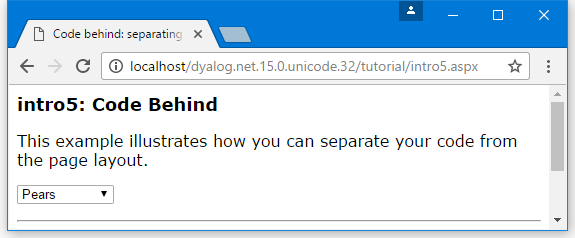

<h1 class="heading"><span class="name">Code Behind</span></h1>

It is often desirable to separate the code content of a page completely from the HTML and other text, layout or graphical information by placing it in a separate file. In ASP.NET parlance, this technique is known as *code behind*.

The `intro5.aspx` example illustrates this technique.
```
<%@Page Language="Dyalog"
	Inherits="FruitSelection"
	src="fruit.apl" %>
<%@Register TagPrefix="tutorial" Namespace="Tutorial" Assembly="tutorial" %>
<html>
<head>
<title>Code behind: separating your code from the page layout</title>
<link rel="stylesheet" type="text/css" href="apl.css">
</head>
<body>
<h1>intro5: Code Behind</h1>
<p>This example illustrates how you can separate your code from the page layout.</p>
<form  runat="server" >
<asp:DropDownList id="list"
	runat="server"
	autopostback="true"
	OnSelectedIndexChanged="Select"/>
<p>
<asp:Label id="out" runat="server" /></p>
</form>
</body>
<tutorial:index runat="server"/>
</html>
```

The statement
```
%@Page Language="Dyalog" Inherits="FruitSelection" src="fruit.apl" %>
```
says that this page, when compiled, should inherit from a class called `FruitSelection`. Furthermore, the `FruitSelection` class is written in the "Dyalog" language, and its source code resides in a file called `fruit.apl`. `FruitSelection` is effectively the *base class* for the `.aspx` page.

In this case, `fruit.apl` is simply another text file containing the `APLScript` code and is shown below.

```apl
:Class FruitSelection: System.Web.UI.Page
:Using System
 
∇Page_Load
:Access Public
:if 0=IsPostBack
    list.Items.Add ⊂'Pears'
    list.Items.Add ⊂'Nectarines'
    list.Items.Add ⊂'Strawberries'
:endif
∇
 
∇Select args
:Access public
:Signature Select Object,EventArgs
out.Text←'You selected ',list.SelectedItem.Text
∇
:EndClass
```

The first thing to notice is that the file requires `:Class` and `:EndClass` statements. These are required to tell the `APLScript` compiler the name of the class being defined, and the name of its base class. When the source code is in a `.aspx` file, this information is provided automatically by the `APLScript` compiler.

The name of the class, in this case `FruitSelection`, must be the same name as is referenced in the `.aspx` web page file itself (`intro5.aspx`). The base class must be `System.Web.UI.Page`

The body of the script is just the same as the script section from the previous example. Only the names of the fruit have been changed so that it is clear which example is being executed.




