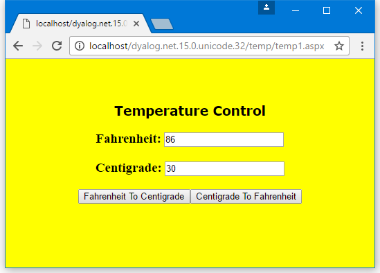

<h1 class="heading"><span class="name">The TemperatureConverterCtl1 Control</span></h1>

The `TemperatureConverterCtl1` control is an example of a *compositional* control, that is, a server-side custom control that is composed of other standard controls.

In this example, The `TemperatureConverterCtl1` control gathers together two textboxes and two push buttons into a single component as illustrated below. Type a number into the *Centigrade* box, click the *Centigrade To Fahrenheit* button, and the control converts accordingly. If you click the *Fahrenheit To Centigrade* button, the reverse conversion is performed.



The `TemperatureConverterCtl1` control  *contains* other standard controls as *child controls*. A control that acts as a container must implement an interface called `INamingContainer`.

This interface does not in fact require any methods; it merely acts as a marker. So the `:Class` statement specifies that it provides this interface:
```apl
:Class TemperatureConverterCtl1: Control,
                  System.Web.UI.INamingContainer
```

## Child Controls

Whenever ASP.NET initialises a `Control`, it calls its `CreateChildControls` method. The default `CreateChildControls` method does nothing). So we simply define a function called `CreateChildControls` with the appropriate public interface (no arguments and  no result) as shown below.
```apl
     ∇ CreateChildControls
[1]    :Access Public override
[2]    :Signature CreateChildControls
[3]
[4]    Controls.Add ⎕NEW LiteralControl,⊂⊂'<h3>Fahrenheit: '
[5]       m_FahrenheitTextBox←⎕NEW TextBox
[6]       m_FahrenheitTextBox.Text←,'0'
[7]       Controls.Add m_FahrenheitTextBox
[8]    Controls.Add ⎕NEW LiteralControl,⊂⊂'</h3>'
[9]
[10]   Controls.Add ⎕NEW LiteralControl,⊂⊂'<h3>Centigrade: '
[11]      m_CentigradeTextBox←⎕NEW TextBox
[12]      m_CentigradeTextBox.Text←,'0'
[13]      Controls.Add m_CentigradeTextBox
[14]   Controls.Add ⎕NEW LiteralControl,⊂⊂'</h3>'
[15]
[16]   F2CButton←⎕NEW Button
[17]   F2CButton.Text←'Fahrenheit To Centigrade'
[18]   F2CButton.onClick←⎕OR'F2CConvertBtn_Click'
[19]   Controls.Add F2CButton
[20]
[21]   C2FButton←⎕NEW Button
[22]   C2FButton.Text←'Centigrade To Fahrenheit'
[23]   C2FButton.onClick←⎕OR'C2FConvertBtn_Click'
[24]   Controls.Add C2FButton
     ∇
```

Line[4] creates an instance of a `LiteralControl` (a label) containing the text "Fahrenheit" with an HTML tag "&lt;h3&gt;". `Controls` is a property of the `Control` class (from which `TemperatureConverterCtl1` inherits) that returns a `ControlCollection` object This has an `Add` method whose job is to add the specified control to the list of child controls managed by the object.

Lines[5-6] create a `TextBox` child control containing the text "0", and Line[7] adds it to the child control list.

Line[8] adds a second `LiteralControl` to terminate the "&lt;h3&gt;" tag.

Lines [10-14] do the same for Centigrade.

Lines[16-17] create a `Button` control labelled "Fahrenheit To Centigrade". Line[18] associates the callback function `F2CConvertBtn_Click` with the button's `onClick` event. Note that it is necessary to assign the `⎕OR` of the function rather than its name. Line[19] adds the button to the list of child controls.

Lines[21-24] create a Centigrade button in the same way.

This function is run every time the page is loaded; however in a postback situation, other code steps in to modify the values in the textboxes, as we shall see.

## Fahrenheit and Centigrade Values

The `TemperatureConverterCtl1` maintains two public properties named `CentigradeValue` and `FahrenheitValue`, which may be accessed by a client application. These properties are not exposed directly as variables, but are obtained and set via *property get* (or *accessor*) and *property set* (or *mutator*) functions. (This is recommended practice for C#, so the example shows how it is done in APL). In this case, the values are simply stored in or obtained directly from the corresponding textboxes set up by `CreateChildControls`.
```apl
      :Property CentigradeValue
        ∇ C←get
          :Access Public
          :Signature Double←get_CentigradeValue
          C←⍎m_CentigradeTextBox.Text
        ∇
        
        ∇ set C
          :Access Public
          :Signature set_CentigradeValue Double Value
          m_CentigradeTextBox.Text←⍕C.NewValue
        ∇
    :EndProperty ⍝ CentigradeValue
```

Notice that the `Get` function uses `⍎` to convert the text in the textbox to a numeric value. Clearly something more robust would be called for in a real application

Similar functions to handle the `Fahrenheit` property are provided but are not shown here.

## Responding to Button presses

We have seen how APL callback functions have been attached to the `onClick` events in the two buttons. The `C2FconvertBtn_Click` callback function simply obtains the `CentigradeValue` property, converts it to Fahrenheit using `C2F`, and then sets the `FahrenheitValue` property.
```apl
     ∇ C2FConvertBtn_Click args
      :Access Public
      :Signature C2FConvertBtn_Click Object,EventArgs
      FahrenheitValue←C2F CentigradeValue
     ∇
 
     ∇ f←C2F c
[1]    f←32+c×1.8
     ∇

     ∇ F2CConvertBtn_Click args
      :Access Public
      :Signature F2CConvertBtn_Click Object ,EventArgs
      CentigradeValue←F2C FahrenheitValue
     ∇
 
     ∇ c←F2C f
[1]    c←(f-32)÷1.8
     ∇
```

The `F2CconvertBtn_Click` callback function converts from Fahrenheit to Centigrade. Note that the functions `C2F` and `F2C` are internal functions that are private to the control, and it is therefore not necessary to define public interfaces for them.

## Using the Control on the Page

The text of the script file `samples\temp\temp1.aspx` is shown below. There is really no difference between this example and the `simple.aspx` described earlier.
```xml
<%@ Register TagPrefix="Dyalog" Namespace="DyalogSamples" 
                                Assembly="TEMP"%>
<html>
<body bgcolor="yellow">
<br><br>
<center>
<h2><font face="Verdana" color="black">Temperature Control</font></h2>

<form runat=server>
<Dyalog:TemperatureConverterCtl1 id=TempCvtCtl1 runat=server/>
</form>
</center>
</body>
</html>
```

The HTML generated by the control at run-time is shown below. Notice that in place of the server-side control declaration in `temp1.aspx`, there are two edit controls with numerical values in them, and two push buttons to submit data entered on the form to the server.
```html
<html>
<body bgcolor="yellow">
<br><br>
<center>
<h2><font face="Verdana" color="black">Temperature Control</font></h2>

<form name="ctrl1" method="post" action="temp1.aspx" id="ctrl1">
<input type="hidden" name="__VIEWSTATE" value="YTB6MTc3MzAxNzYxNF9fX3g=03f01d88" />

<h2>Fahrenheit: <input name="TempCvtCtl1:ctrl1" type="text" value="32" /></h2><h2>Centigrade: <input name="TempCvtCtl1:ctrl4" type="text" value="0" /></h2><input type="submit" name="TempCvtCtl1:ctrl6" value="Fahrenheit To Centigrade" /><input type="submit" name="TempCvtCtl1:ctrl7" value="Centigrade To Fahrenheit" />
</form>

</center>
</body>
</html>

```
