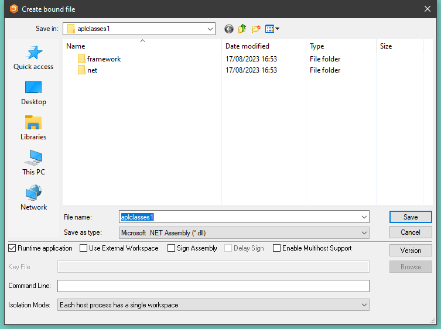
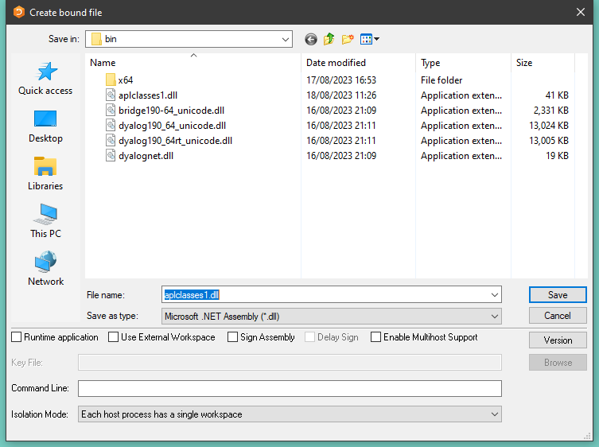

<h1 class="heading"><span class="name">Example 1</span></h1>

Load the workspace `aplclasses1.dws`, then view the `Primitives` class:
```apl
      )load D:\aplclasses\aplclasses1\aplclasses1.dws
D:\aplclasses\aplclasses1\aplclasses1.dws ⍝ saved ...

      )ed ○APLClasses.Primitives
```
!!! note
    The character before the name `APLClasses.Primitives`, `○`, is typically obtained with <kbd>Ctrl</kbd>-<kbd>O</kbd>. It is used to tell the editor to edit a class.

```apl
:Class Primitives
:Using System
     ∇ r←IndexGen n
      :Access public
      :Signature Int32[]←IndexGen Int32 n
      r←⍳n
     ∇
:EndClass 
```

`Primitives` contains one public method/function named `IndexGen`.

The public characteristics for the exported method are included in the definition of the class and its functions. Those are specified in the `:Signature` statement.

Its syntax is:
```
:Signature [return type←] fnname [arg1type [arg1name]
                                 [,argNtype [argNname]]*]
```

that is: The type of the result returned by the function - followed by arrow - if any, the exported name (it can be different from the APL function name but it must be provided), and, if any arguments are to be supplied, their types and optional names, each type-name pair separated from the next by a comma. In the example above the function returns an array of 32-bit integers and takes a single integer as its argument. For further details, see [Signature Statement](../../../programming-reference-guide/defined-functions-and-operators/traditional-functions-and-operators/control-structures/signature).

Note that, when the class is fixed, APL will try to find the .NET data types you have specified for the result and for the parameters. If one or more of the data types are not recognised as available .NET Types, you will be informed in the status window and APL will refuse to fix the class. If you see such a warning you have either entered an incorrect data type name, or you have not set `:Using` correctly, or some other syntax problem has been detected (for example the function is missing a terminating `∇`. In the previous example, the only data type used is `System.Int32`. Since we have set `:Using System,` the name `Int32` is found in the right place and all is well.

It should be noted that in the previous release of Dyalog the statements :`Returns` and :`ParameterList` were used instead of :`Signature`. They are still accepted for backwards compatibility but are considered deprecated. Their syntax will not be documented here but a list can be found in Appendix A.

Now you are ready to create the assembly. This is done by selecting *Export…* from the Session *File* menu. This displays the following dialog box.



This gives you the opportunity to change the name or path of the assembly.  The *Runtime application* checkbox allows you to choose to which if the two versions of the Dyalog dynamic link library the assembly will be bound. In this tutorial we will use the Development version. The *Isolation Mode* Combo box allows you to choose which Isolation Mode you require.

- Browse to the `Framework\bin` sub-diectory.
- Clear the *Runtime application* checkbox



Finally, click *Save*. APL now makes the assembly and, as it does so, displays information in the Status window as shown below. If any errors occur during this process, the Status window will inform you.


## program.cs

The following C# source, called `aplclasses1Framework\program.cs`, will be used to call our Dyalog.NET Class.

The `using` statements specify the names of .NET namespaces to be searched for unqualified class names.

The program creates an object named `apl` of type `Primitives` by calling the `new` operator on that class. Then it calls the `IndexGen` method with a parameter of 10.
```cs
      using System;
      using APLClasses;
      public class MainClass
          {
          public static void Main()
              {
                  Primitives apl = new Primitives();
                  int[] rslt = apl.IndexGen(10);
                  for (int i=0;i<rslt.Length;i++)
                  Console.WriteLine(rslt[i]);
              }
          }
```

Using VS, open the solution file `d:\aplclasses\aplclasses1\Framework\project.sln` and view `program.cs`.


Now click *Debug/Start Without debugging* (or press <kbd>Ctrl</kbd>+<kbd>F5</kbd>) to run the program. The results are shown in a console window.


