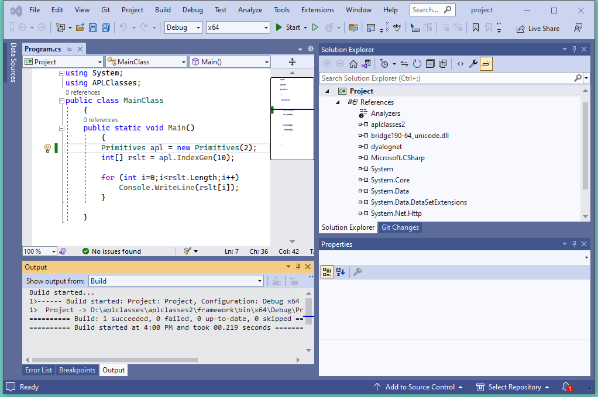

<h1 class="heading"><span class="name">Example 2a</span></h1>

In Example 2, the argument to `CTOR`, the constructor for the `Primitives` class, was defined to be `Int32`. This means that the .NET Framework will allow a client to specify *any* integer when it creates an instance of the `Primitives` class. What happens if the client uses a parameter of 2? Clearly this is going to cause an APL `DOMAIN ERROR` when used to set `⎕IO`.

To investigate this case, change the line of code in `program.cs` that creates an instance of the Primitives class, passing the argument 2, like this:
```cs
Primitives apl = new Primitives(2);
```



Then click *Debug/Start Without debugging* (or press <kbd>Ctrl</kbd>+<kbd>F5</kbd>) to run the program.

… as we have built the Dyalog .NET class to use the *Development DLL*, the APL Session appears, and the Tracer can be used to debug the problem. You can see that the constructor `CTOR` has stopped with a `DOMAIN ERROR`. Meanwhile, the C# program is still waiting for the call (to create an instance of `Primitives`) to finish.


Notice that in Dyalog, the `)SI` System Command  provides information about the entire calling stack, including the .NET function calls that are involved. Notice too that the `CTOR` function, the constructor for this APL .NET class, is running here in APL thread 1, which is associated with the system thread 30732.

In this case, debugging is simple, and you can simply type:
```apl
      IO←1
      →⎕LC
```

Now, the `CTOR` function completes, the program continues and the output is displayed.


