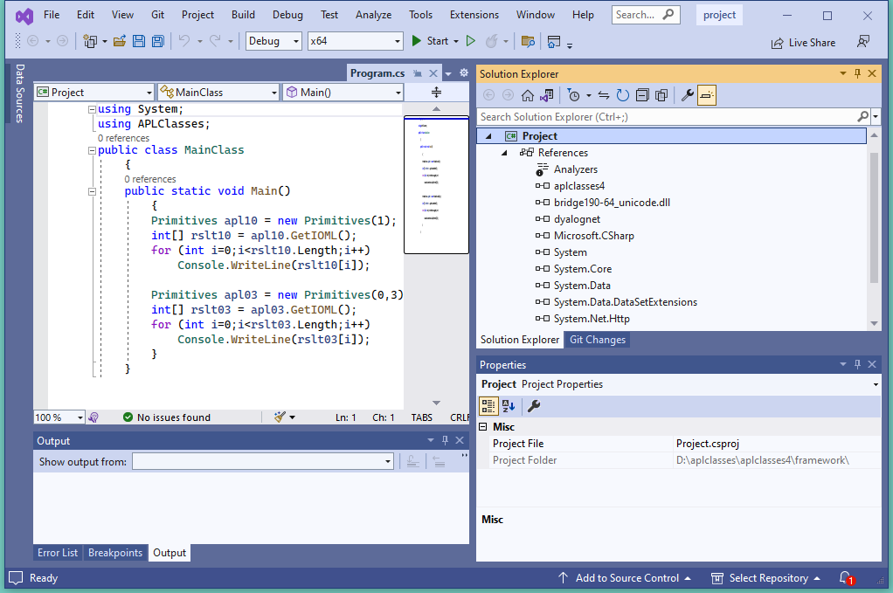

<h1 class="heading"><span class="name">Example 4</span></h1>

This example builds on Example 3 and illustrates how you can implement *constructor overloading*, by establishing several different constructor functions.

By way of an example, when a client application creates an instance of the `Primitives` class, we want to allow it to specify the value of `⎕IO` or the values of both `⎕IO` and `⎕ML`.

The simplest way to implement this is to have two public constructor functions `CTOR1` and `CTOR2`, which call a private constructor function `CTOR`.

`aplclasses4.dws` contains a new version of the `Primitives` class with these additions:
```apl 
      ∇ CTOR1 IO
[1]    :Implements constructor
[2]    :Access public
[3]    :Signature CTOR1 Int32 IO
[4]    CTOR IO 0
     ∇
```
```apl
     ∇ CTOR2 IOML
[1]    :Implements constructor
[2]    :Access public
[3]    :Signature CTOR2 Int32 IO,Int32 ML
[4]    CTOR IOML
     ∇
```
```apl
     ∇ CTOR IOML;EX
[1]    IO ML←IOML
[2]    :If ~IO∊0 1
[3]        EX←⎕NEW ArgumentException,⊂⊂'IndexOrigin must
                                               be 0 or 1'
[4]        EX ⎕SIGNAL 90
[5]    :EndIf
[6]    :If ~ML∊0 1 2 3
[7]        EX←⎕NEW ArgumentException,⊂⊂'MigrationLevel
                                    must be 0, 1, 2 or 3'
[8]        EX ⎕SIGNAL 90
[9]    :EndIf
[10]   ⎕IO ⎕ML←IO ML
     ∇ 
```

The `:Signature` statements for these three functions show that `CTOR1` is defined as a constructor that takes a single `Int32` parameter, `CTOR2` is defined as a constructor that takes two `Int32` parameters, and `CTOR` has no .NET Properties defined at all. Note that in .NET terms, `CTOR` is not a *Private Constructor*; it is simply an internal function that is invisible to the outside world.

Next, a function called `GetIOML` is defined and exported as a Public Method. It simply returns the current values of `⎕IO` and `⎕ML`.
```apl
     ∇ R←GetIOML
[1]   :Access public
[2]   :Signature Int32[]←GetIOML
[3]    R←⎕IO ⎕ML
     ∇   
```

Load `aplclasses4.dws` and export a new version of `aplclasses.dll` as before.


## program.cs

`aplclasses4\Framework\program.cs` contains code to invoke the two different constructor functions `CTOR1` and `CTOR2` :
```cs
using System;
using APLClasses;
public class MainClass
	{
	public static void Main()
		{
		Primitives apl10 = new Primitives(1);
		int[] rslt10 = apl10.GetIOML();
		for (int i=0;i<rslt10.Length;i++)
			Console.WriteLine(rslt10[i]);

		Primitives apl03 = new Primitives(0,3);
		int[] rslt03 = apl03.GetIOML();
		for (int i=0;i<rslt03.Length;i++)
			Console.WriteLine(rslt03[i]);
		}
	}
```

Here the code creates two instances of the Primitives class named `apl10` and `apl03`. The first is created with a constructor parameter of `(1)`; the second with a constructor parameter of `(0,3)`.

The C# compiler matches the first call with `CTOR1`, because `CTOR1` is defined to accept a single `Int32` parameter. The second call is matched to `CTOR2` because `CTOR2` is defined to accept two `Int32` parameters.

Using VS, open the solution file `d:\aplclasses\aplclasses4\Framework\project.sln` and view `program.cs`.



Click *Debug/Start Without debugging* (or press <kbd>Ctrl</kbd>+<kbd>F5</kbd>) to run the program. The results are shown in a console window.


