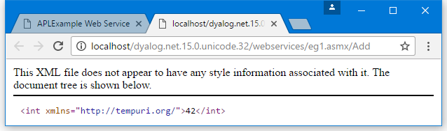

<h1 class="heading"><span class="name">Sample Web Service: EG1</span></h1>

The first APLExample sample is supplied in `samples\asp.net\webservices\eg1.asmx` which is mapped via an IIS Virtual Directory to the URL:
```apl
 http://localhost/dyalog.net.15.0.unicode.32/webservices/eg1.asmx
```
```apl
 
<%@ WebService Language="Dyalog" Class="APLExample" %>
 
:Class APLEXample: System.Web.Services.WebService
:Using System
 
 ∇ R←Add args
   :Access WebMethod
   :Signature Int32←Add Int32 arg1,Int32 arg2
   R←+/args
 ∇
 
:EndClass
```

The `Add` function defined above is exported as a method that takes exactly (and only) two parameters of type `Int32` and returns a result of type `Int32`.

Line [3] could in fact be coded as:
```apl
   R←args[1]+args[2]
```

because .NET guarantees that a client can only call the method by providing two 32-bit integers as parameters.

## Testing APLExample from a Browser

If you connect to a URL that represents a Web Service, the browser displays a page that provides information about the service and the methods that it contains. In certain cases, but by no means all, the page also contains form fields that let you invoke a method from the browser.

The screen shot below shows the page displayed by Google Chrome when it is pointed at `eg1.asmx`. It shows that the Web Service is called `APLExample`, and that it exports a single method called `Add`. Furthermore, the `Add` method takes two parameters of type `int`, named *arg1* and *arg2*.


The following screen shot shows the result of entering the values 23 and 19 into the form fields and then pressing the Invoke button.

In this case, the method returns an `int` value 42.



It is important to understand what is happening here.

Accessed in this way from a browser, a Web Service appears to be behaving like a Web Server; this is not the case.

It is simply that the browser detects that the target URL is a Web Service, and invokes an ASP+ page named `DefaultSdlHelpGenerator.aspx` that inspects the compiled class and returns an HTML view of the Web service.
