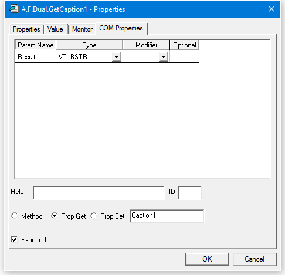

<h1 class="heading"><span class="name">The Dual Control Tutorial</span></h1>

The ActiveX control we will use in this example is deliberately an extremely simple one; so that the intricacies of the control itself do not get in the way of the principles involved. In practice, there are actually very few restrictions concerning the complexity of the ActiveX control, and it is perfectly possible to package complete multiple-window Dyalog APL applications in this way.

Your ActiveX control will be called a *Dyalog Dual Control* and is based on the Dyalog APL TrackBar object.

The Dual control allows the user to enter a number using a slider, whilst displaying its value in two different units. For example, you could use it to enter a temperature value which is displayed in both Centigrade and Fahrenheit units. Equally, the same control could be used to enter a measurement of length which is concurrently displayed in centimetres and inches.


## Methods

None (the Dual control provides no methods.)

## Properties

The Dual control provides the following properties:

| Property | Description |
| --- | ---  |
| Caption1 | A text string that describes the primary units. This is displayed in the top left corner of the object. |
| Caption2 | A text string that describes the secondary or derived units. This is displayed in the bottom left corner of the object. |
| Value1 | The current value of the control measured in primary units |
| Value2 | The current value of the control measured in secondary units. |
| Intercept | Used to derive Value2 from Value1 |
| Gradient | Used to derive Value2 from Value1 |
| Min | The minimum value of Value1 |
| Max | The maximum value of Value1 |

Value2 is derived from Value 1 using the expression:
```apl
      Value2←Intercept+Gradient×Value1
```

## Events

Your Dual control will generate a *ChangeValue1* event whenever the user alters Value1 using the slider.

The event message will contain a single parameter (the new value) which may be modified by the host application.

In other words, every time the value in the control changes, the host application may detect this as an event and has the opportunity to override the user.

Your Dual control will also generate a *ChangeValue2* event whenever the derived value in the control (Value2) changes. This event is reported for information only.

## Introducing the Dual Control

To save time, the basic APL code for the Dual control has already been written. Two workspaces are provided in the `samples\activex` subdirectory named `dualbase.dws` and `dualfns.dws`. You will use these workspaces to build the ActiveX control yourself.

## Preparing a Working Directory

To run this tutorial you will need to save files to a directory on your computer to which you have write access. This example uses a directory named `c:\MyWS`.

The directory is required to store the workspace and ActiveXControl, `Dual.ocx` as you develop them.

A Dyalog ActiveXControl uses  the dynamic-link library version of the Dyalog interpreter  which must be present in the same directory as the `.ocx` file, so you must copy the appropriate version here before you can start the tutorial. You may use either the Development DLL or the Run-Time DLL. If you choose to use the Development DLL, you will also need to copy the DyaRes DLL which it uses.

For the names of these files corresponding to the version of Dyalog that you are using, see [Files and Directories](../../../windows-installation-and-configuration-guide/files-and-directories).

!!!note "Start Dyalog as Administrator"
    Under Windows 7 and later, you have to have administrator privileges to register a COM component. Therefore, you must run Dyalog as administrator. If you fail to do this, the registration process will fail. If so, you can continue the process where you left off by closing Dyalog, restarting as administrator, and reloading the workspace.

## Getting Started

- Load the `samples\activex\dualbase.dws` workspace:
    ```apl
          )LOAD dualbase
    C:\Program Files (x86)\Dyalog\Dyalog APL 15.0 Unicode\...
    ```

- Run the function `TEST` and observe how the 2 Dual controls behave.

- View the function `TEST` and observe how 2 separate instances of the `Dual` namespace `F.D1` and `F.D2` have been created using `⎕OR` and `⎕NS`.

- Using the Dyalog APL Workspace Explorer, open up the various namespaces. See how `F.D1` and `F.D2` are clones of `Dual`.

- Open the function `Dual.Create` and see how the individual components of the control are defined.

- Close the Form `F`.

## Changing Dual into an ActiveX Control

Change the name of the workspace to Dual in a directory to which you have write-access:
```apl
      )WSID c:\MyWS\Dual
```

Make a new namespace called `F`
```apl
      )NS F
```

Using the Workspace Explorer, move the `Dual` namespace into `F`, so that `Dual` is a child namespace of `F`.

Now edit the function `F.Dual.Create` and make the following changes:

Remove all references to the local variable `POSITION`. This change is required because an ActiveX control has no say in its position within its parent. (Hint: use the Search/Replace dialog to remove all occurrences of `POSITION+`)

Remove the right argument, `SIZE` and change `Create[1]` from:
```apl
      H W←SIZE
```

to
```apl
      H W←Size
```

This change allows the control to fit itself within the space allocated by the host application.

Change `Create[4]` from:
```apl
      CH←⊃##.GetTextSize 'W'
```

to
```apl
      CH←⊃GetTextSize 'W'
```

The original code was designed to pick up the character height from the parent Form. The ActiveXControl object does this automatically via its own GetTextSize method.

After making these changes, the Create function should be as follows:
```apl
     ∇ Create;H;W;POS;SH;CH;Y1;Y2
[1]    H W←Size
[2]    SH←40 ⍝ Default TrackBar height
[3]    POS←2↑⌊0.5×0⌈(H-SH)
[4]    CH←⊃GetTextSize'W'
[5]    'Slider'⎕WC'TrackBar'(POS)('Size'SH W)
[6]    Slider.(Limits AutoConf)←(Min,Max)0
[7]    Slider.(TickSpacing TickAlign)←10 'Top'
[8]    Slider.onThumbDrag←'ChangeValue'
[9]    Slider.onScroll←'ChangeValue'
[10]   Y1←POS[1]-CH+1
[11]   Y2←POS[1]+SH+1
[12]   'Cap1'⎕WC'Text'Caption1(Y1,0)('AutoConf' 0)
[13]   'Cap2'⎕WC'Text'Caption2(Y2,0)('AutoConf' 0)
[14]   'V1'⎕WC'Text'(⍕Value1)(Y1,W)
                    ('HAlign' 2)('AutoConf' 0)
[15]   CalcValue2
[16]   'V2'⎕WC'Text'(⍕Value2)(Y2,W)
                    ('HAlign' 2)('AutoConf' 0)
     ∇
```

Open the function `F.Dual.Build`. This function turns the Dual's parent namespace into a Form (an ActiveXControl  requires a parent Form) and turns Dual itself into an ActiveXControl. It then attaches functions Create and Configure as callbacks on the Create and Configure events of the ActiveXControl object itself.
```apl
     ∇ Build
[1]    ##.⎕WC'Form'('Coord' 'Pixel')('KeepOnClose' 1)
[2]    ⎕WC'ActiveXControl'('Size' 80 200)
                          ('KeepOnClose' 1)
[3]    ⎕WS'Event' 'Create' 'Create'
[4]    ⎕WS'Event' 'Configure' 'Configure'
[5]    ⎕NQ'' 'Create'
     ∇
```

Run function `F.Dual.Build`. You should see a Form containing a single instance of the Dual control. Please resist any temptation to play with it at this stage; we want it to be in its default state for when we save it.

Type the following expression; note that the ClassID, which uniquely identifies your control (and so will not be the same as that shown below), is allocated when you create the ActiveXControl object.
```apl
        F.Dual.ClassID
{002F9614-50F7-4F3B-BB0B-FA3316964E78}
```

Save the workspace (`c:\MyWS\Dual.dws`).

From the Session *File* menu, select *Export*, choose where you want to save your OCX, and then click Save. It is a good idea to clear the *Runtime application* checkbox so that you can debug the control if anything goes wrong.


## Testing the Dual Control

This section describes how you can test and exercise the Dual control using any appropriate version of Microsoft Visual Studio, such as Microsoft Visual Studio Community 2015, and  language (e.g. Visual Basic) of your choice. This tool is henceforth referred to herein as VB.

- Start VB and create a new *Windows Forms Application Project*.
- Click the right mouse button in the General section of the Toolbox window and select  *Choose Items ...* from the pop-up menu. In the *Choose Toolbox Items* dialog box, click the *COM Components* tab.
- Locate the control named *Dyalog Dual Control*, enable its check box and click *OK*. This adds a tool for the Dual control to the VB Toolbox.
- Click on the new tool and drag it onto your Form. An instance of the Dual control will appear.
- Repeat this step to position a second instance of the Dual control on your VB Form.
- Click the *Start Debugging* button.
- Exercise the two Dual controls.
- Click the *Stop Debugging* button.
- Click on one of the Dual controls and scroll through its Property list. Notice that all the properties listed are standard VB ones; there are no properties (or indeed methods and events) exported. We will learn how to do this next.

Close but **do not** save the project.

## Defining and Exporting Properties

Back in the Dyalog Session, change space into the `F.Dual` namespace.
```apl
      )CS F.Dual
```

The properties we wish to export are:

 <table>
    <tr>
        <td>Caption1</td>
        <td>Description of the primary set of units</td>
    </tr>
    <tr>
        <td>Caption2</td>
        <td>Description of the secondary set of units</td>
    </tr>
    <tr>
        <td>Value1</td>
        <td>The primary value in the control</td>
    </tr>
    <tr>
        <td>Min</td>
        <td>Minimum for Value1</td>
    </tr>
    <tr>
        <td>Max</td>
        <td>Maximum for Value1</td>
    </tr>
    <tr>
        <td>Intercept</td>
        <td>Used to derive the secondary value (Value2)</td>
    </tr>
    <tr>
        <td>Gradient</td>
        <td>Used to derive the secondary value (Value2)</td>
    </tr>
</table>

Although we could export all these properties as variables, it is generally more useful to employ *Get* and *Put* functions. The reason for this is that there is no mechanism to detect when the host application changes a property/variable; nor is there any mechanism to prevent it assigning an inappropriate value. The *Get* and *Put* functions you need are listed below. To save you time, you can copy them in from the workspace `samples\activex\dualfns.dws`.
```apl
      )COPY dualfns
C:\Program Files (x86)\Dyalog\Dyalog APL 15.0 Unicode\...

     ∇ R←GetCaption1
[1]    R←Caption1
 
     ∇ SetCaption1 C
[1]    Cap1.Text←Caption1←C
 
     ∇ R←GetCaption2
[1]    R←Caption2
 
     ∇ SetCaption2 C
[1]    Cap2.Text←Caption2←C
 
     ∇ R←GetIntercept
[1]    R←Intercept

     ∇ SetIntercept I
[1]    Intercept←I
[2]    CalcValue2
[3]    V2.Text←⍕Value2
 
     ∇ R←GetGradient
[1]    R←Gradient
 
     ∇ SetGradient G
[1]    Gradient←G
[2]    CalcValue2
[3]    V2.Text←⍕Value2
 
     ∇ R←GetValue1
[1]    R←Value1
 
     ∇ SetValue1 V
[1]    1 ⎕NQ'' 'ChangeValue'V
```

The `Get` functions need no explanation; they simply return the value of the corresponding variable. The `Set` functions assign a new value to the corresponding variable and update the control accordingly. `SetValue1` does this by enqueuing a Scroll event to the Slider, which in turn invokes the `ChangeValue` callback.

Display the *Object Properties* dialog box for the function `GetCaption1`. (Hint: use the Workspace Explorer).

Select the *COM Properties* tab. As you have not yet defined any OLE attributes, the default display is as follows:


Check the *Exported* option button.

Change the data type for the *Result* to VT_BSTR (a text string).

Check the *Prop Get* radio button to indicate that this is a *Property Get* function and enter the name of the property (`Caption1`) to which it applies.

Note that it is not necessary for the property name referenced by the *Get* and *Put* functions to correspond to a variable name, although in this case it does.

The final *COM Properties* dialog box for `GetCaption1` should appear as follows. Click *OK* to save your changes.



Now do the same for the `SetCaption1` function. This function takes an argument which it expects to be a character vector. It must therefore be defined as having a single parameter of data type VT_BSTR; the parameter name is unimportant. However, you must ensure that the *Optional* button is unchecked.

In APL terms, the function does not return a result. However, in OLE terms the result is defined to be of type VT_VOID. Alternatively, you may just leave this field empty.

The OLE properties for `SetCaption1` should appear as follows:


An alternative way to define the syntax for exported functions is to use the *COM Functions* tab in the Properties dialog box for the ActiveXControl object itself. (Hint: using the Workspace Explorer, open `F` so that its contents, `Dual`, are displayed in the right-hand list, select `Dual`, then click *Props*).

The *COM Functions* tab should appear as follows:


The right-hand Combo box allows you to view and edit their syntax for the exported functions you have already defined. The left-hand Combo box displays the list of other non-exported functions that are defined in the ActiveXControl.

Select `GetCaption2` from the left-hand Combo box, and then click *Add*. The dialog box will change to display the default syntax for `GetCaption2`. Alter the *Result* data type to VT_BSTR, select *Prop Get*, and enter the name of the property, `Caption2`, so that the dialog box appears as follows:


The third way to define the syntax for exported functions is to use the SetFnInfo method of the ActiveXControl object. This allows you to export functions using APL code, which in some circumstances may be more convenient than filling in dialog boxes.

The SetFnInfo method requires the name of the function, its syntax, a help id, a code which specifies its type (0 = method, 2 = property get, 4 = property put) and, if appropriate, the name of the property to which it applies, that is
```apl
      SetFnInfo fn syntax helpid type property
```

The function `syntax` is a nested array whose first element defines the function's result and whose subsequent elements define each of its parameters. Each syntax specifier is a single character string that defines a data type, or a pair of character strings. If so, the first string for the result defines a help string, and the first string for each parameter defines its name.

The following table describes the information we must specify for each of the functions to be exported:

**Exported Functions**

 <table>
    <tr>
        <th rowspan="2">Function</th>
        <th rowspan="2">Result</th>
        <th colspan="2">Parameter</th>
        <th rowspan="2">Get/Put</th>
        <th rowspan="2">Property</th>
    </tr>
    <tr>
        <th>Name</th>
        <th>Type</th>
    </tr>
    <tr>
        <td>GetCaption1</td>
        <td>VT_BSTR</td>
        <td>&#160;</td>
        <td>&#160;</td>
        <td>Get(2)</td>
        <td>Caption1</td>
    </tr>
    <tr>
        <td>GetCaption2</td>
        <td>VT_BSTR</td>
        <td>&#160;</td>
        <td>&#160;</td>
        <td>Get(2)</td>
        <td>Caption2</td>
    </tr>
    <tr>
        <td>GetGradient</td>
        <td>VT_R8</td>
        <td>&#160;</td>
        <td>&#160;</td>
        <td>Get(2)</td>
        <td>Gradient</td>
    </tr>
    <tr>
        <td>GetIntercept</td>
        <td>VT_R8</td>
        <td>&#160;</td>
        <td>&#160;</td>
        <td>Get(2)</td>
        <td>Intercept</td>
    </tr>
    <tr>
        <td>GetValue1</td>
        <td>VT_I4</td>
        <td>&#160;</td>
        <td>&#160;</td>
        <td>Get(2)</td>
        <td>Value1</td>
    </tr>
    <tr>
        <td>SetCaption1</td>
        <td>VT_VOID</td>
        <td>Caption1</td>
        <td>VT_BSTR</td>
        <td>Put(4)</td>
        <td>Caption1</td>
    </tr>
    <tr>
        <td>SetCaption2</td>
        <td>VT_VOID</td>
        <td>Caption2</td>
        <td>VT_BSTR</td>
        <td>Put(4)</td>
        <td>Caption2</td>
    </tr>
    <tr>
        <td>SetGradient</td>
        <td>VT_VOID</td>
        <td>Gradient</td>
        <td>VT_R8</td>
        <td>Put(4)</td>
        <td>Gradient</td>
    </tr>
    <tr>
        <td>SetIntercept</td>
        <td>VT_VOID</td>
        <td>Intercept</td>
        <td>VT_R8</td>
        <td>Put(4)</td>
        <td>Intercept</td>
    </tr>
    <tr>
        <td>SetValue1</td>
        <td>VT_VOID</td>
        <td>Value1</td>
        <td>VT_I4</td>
        <td>Put(4)</td>
        <td>Value1</td>
    </tr>
</table>

From this table we can easily construct the corresponding SetFnInfo statements. For example, the statement for `GetCaption1` is:
```apl
      SetFnInfo 'GetCaption1' 'VT_BSTR' ¯1 2 'Caption1'
```

Note that `¯1` in the 3<sup>rd</sup> element of the right argument specifies that there is no help id.

Open the function `F.Dual.EXPORT`; this contains statements to export all the *Get* and *Put* functions we need.

Run the function and save the workspace.
```apl
      )CS
#
      F.Dual.EXPORT
            )SAVE
c:\MyWS\Dual.dws saved Mon Aug  1 14:52:14 2016

```

Then, re-export the workspace, updating your `.ocx` file with all the new information.


## Setting Properties from VB

Start VB and create a new Windows Forms Application Project.

If the Dyalog Dual Control is not already in the Toolbox, click the right mouse button in the General section of the Toolbox window and select  *Choose Items ...* from the pop-up menu. In the *Choose Toolbox Items* dialog box, click the *COM Components* tab.

Locate the control named *Dyalog DUAL Control*, enable its checkbox and click *OK*. This adds a tool for the Dual control to the VB Toolbox.

Click on the Dyalog Dual tool and drag it onto your Form. An instance of the Dual control will appear.

In the Properties dialog box, change the default Dual1 properties to the following:

 <table>
    <tr>
        <td>Caption1</td>
        <td>Centimetres</td>
    </tr>
    <tr>
        <td>Caption2</td>
        <td>Inches</td>
    </tr>
    <tr>
        <td>Gradient</td>
        <td>0.3937</td>
    </tr>
    <tr>
        <td>Intercept</td>
        <td>0</td>
    </tr>
</table>

Double-click the left mouse button over your Form (*Form1*). This will bring up the code editor dialog box. Edit the `Form1_Load()` subroutine, entering the program statements shown below. This code will be run when VB starts your application and loads the Form *Form1*. It illustrates how you can change the properties of your Dyalog APL ActiveX control dynamically.


Now test your application by clicking *Start Debugging*. When you have finished, click  *Stop Debugging*.

Close but **do not** save the project. This is necessary to allow you to rebuild the Dual ActiveX control which is (currently) loaded in your VB application. Otherwise, Dyalog will be unable to overwrite the `.ocx` file.

## Defining and Exporting Events

Back in Dyalog, using the Workspace Explorer, open the callback function `F.Dual.ChangeValue` and alter `ChangeValue[2]` from:
```apl
    Value1←⊃¯1↑MSG
```

to
```apl
    Value1←⊃4 ⎕NQ '' 'ChangeValue1' (⊃¯1↑MSG)
```

Then close the function. Previously, the `ChangeValue` function simply accepted the new value (of the TrackBar thumb) that it received as the last element of the event message. Now it generates an external ChangeValue1 event for the host application using `4 ⎕NQ`. The host may in turn modify the new value which is returned as the result of the expression. Thus, not only can Dyalog APL generate events which are detectable by the host application, it can also accept modifications.

Again using the Workspace Explorer, open the Properties dialog box for the Dual object itself and select the *COM Events* tab.

Enter the name of the event `ChangeValue1` into the edit box labelled *Name*.

Click *Add*

Click the right mouse button over the *Result* row and select *Insert*

In the column labelled *Param Name* enter  `Value1`, then change the *Type* to VT_I4 and the *Modifier* to VT_PTR. This defines a parameter named `Value1` that supplies a pointer to an integer. The fact that it is a *pointer* means that the (integer) parameter may be modified by the host application.

The final appearance of this dialog box should be as follows:


Click *OK*, change back to the root space, and save the workspace.
```apl
      )CS #
      )SAVE
```

Select *File/Export* and rebuild your `.ocx` file.


## Using Events from VB

Back in VB, create a new Windows Application Project.

Check that the *Dyalog DUAL Control* tool is available in the ToolBox.

If not:

- click the right mouse button in the General section of the Toolbox window and select  *Choose Items ...* from the pop-up menu. In the *Choose Toolbox Items* dialog box, click the *COM Components* tab.
- locate the control named *Dyalog DUAL Control*, set its checkbox on and click *OK*. This adds a tool for the Dual control to the VB Toolbox.

Click on the *Dyalog DUAL Control* tool and drag it onto your Form. An instance of the Dual control will appear.

Select the label tool and add a label object (*Label1*) to the Form. Select its Font property and change it to 14-point bold.


View the code window and choose the object AxDual1 and its only event ChangeValue1. Enter a line of code to set the Caption property of the Label object Label1 to the String equivalent of the event parameter Value1.

Enter the following code, and then close the code window, that is
```apl
Label1.Text = Str(e.Value1)
```


Start the application using *Start Debugging*. Exercise the Dual control and observe that VB updates the Label1 control in response to the ChangeValue1 events. When you have finished, select *Stop Debugging*.


In the code window, add the following line of code to the `AxDual1_ChangeValue` subroutine:
```apl
e.Value1=2 * (e.Value1\2)
```


Start the application using *Start Debugging*. Exercise the Dual control and observe that now the slider moves in increments of 2. When you have finished, select *Stop Debugging*


