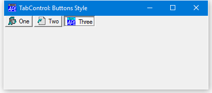
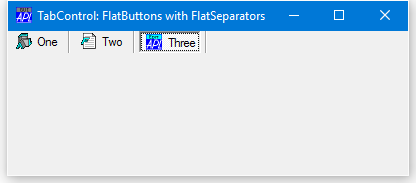
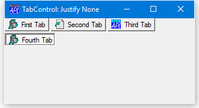

<h1 class="heading"><span class="name">The TabControl and TabButton Objects</span></h1>

The TabControl object provides access to the standard Windows NT tab control.

The standard tab control is analogous to a set of dividers in a notebook and allows you to define a set of *pages* that occupy the same area of a window or dialog box. Each page consists of a set of information or a group of controls that the application displays when the user selects the corresponding tab.

A special type of tab control displays tabs that look like buttons. For example, the Windows 98 taskbar is such a tab control.

To implement a multiple page tabbed dialog, illustrated below, you should create a Form, then a TabControl with Style `'Tabs'` (which is the default) as a child of the Form.
```apl
'F'⎕WC'Form' 'TabControl: Default'('Size' 25 50)
'F.TC'⎕WC'TabControl'
```

Individual tabs or buttons are represented by TabButton objects which should be created as children of the TabControl object. Optional captions and pictures are specified by the Caption and ImageIndex properties of the individual TabButton objects themselves.

Note that the icons used in these examples are provided in the `ws` sub-directory.
```apl
icodir←(2 ⎕NQ'.' 'GetEnvironment' 'Dyalog'),'\ws\'

'F.TC.IL'⎕WC'ImageList'
'F.TC.IL.'⎕WC'Icon'(icodir,'aplicon.ico')
'F.TC.IL.'⎕WC'Icon'(icodir,'funicon.ico')
'F.TC.IL.'⎕WC'Icon'(icodir,'editicon.ico')
'F.TC'⎕WS'ImageListObj' 'F.TC.IL'
```

Next, create one or more pairs of TabButton and SubForm objects as children of the TabControl. You associate each SubForm with a particular tab by setting its TabObj property to the name of the associated TabButton object. Making the SubForms children of the TabControl ensures that, by default, they will automatically be resized correctly. (You may alternatively create your SubForms as children of the main Form and establish appropriate resize behaviour using their Attach property.)
```apl
'F.TC.T1'⎕WC'TabButton' 'One'('ImageIndex' 1)
'F.TC.T2'⎕WC'TabButton' 'Two'('ImageIndex' 2)
'F.TC.T3'⎕WC'TabButton' 'Three'('ImageIndex' 3)
'F.TC.S1'⎕WC'SubForm'('TabObj' 'F.TC.T1')
'F.TC.S2'⎕WC'SubForm'('TabObj' 'F.TC.T2')
'F.TC.S3'⎕WC'SubForm'('TabObj' 'F.TC.T3')
```


## Style, FlatSeparators and HotTrack Properties

The Style property determines the overall appearance of the tabs or buttons in a TabControl and may be `'Tabs'` (the default), `'Buttons'` or `'FlatButtons'`.

A TabControl object with Style `'Buttons'` or `'FlatButtons'` may be used in a similar way (that is, to display a set of alternative pages), although buttons in this type of TabControl are more normally used to execute commands. For this reason, these styles of TabControl are borderless.




If Style is `'FlatButtons'`, the FlatSeparators property specifies whether or not separators are drawn between the buttons. The following example illustrates the effect of setting FlatSeparators to 1.



The HotTrack property specifies whether or not the tabs or buttons in a TabControl object (which are represented by TabButton objects), are automatically highlighted by the mouse pointer.

## The Align Property

The Align property specifies along which of the 4 edges of the TabControl the tabs or buttons are arranged. Align also controls the relative positioning of the picture and Caption within each TabButton. Align may be Top (the default), Bottom, Left or Right.

If Align is `'Top'` or `'Bottom'`, the tabs or buttons are arranged along the top or bottom edge of the TabControl and the picture is drawn to the left of the Caption.
```apl
'F'⎕WC'Form' 'TabControl: Align Bottom'('Size' 25 50)
'F.TC'⎕WC'TabControl'('Align' 'Bottom')
 
'F.TC.IL'⎕WC'ImageList'
'F.TC.IL.'⎕WC'Icon'(icodir,'aplicon.ico')
'F.TC.IL.'⎕WC'Icon'(icodir,'funicon.ico')
'F.TC.IL.'⎕WC'Icon'(icodir,'editicon.ico')
 
'F.TC'⎕WS'ImageListObj' 'F.TC.IL'
 
'F.TC.T1'⎕WC'TabButton' 'One'('ImageIndex' 1)
'F.TC.T2'⎕WC'TabButton' 'Two'('ImageIndex' 2)
'F.TC.T3'⎕WC'TabButton' 'Three'('ImageIndex' 3)
 
'F.S1'⎕WC'SubForm'('TabObj' 'F.TC.T1')
'F.S2'⎕WC'SubForm'('TabObj' 'F.TC.T2')
'F.S3'⎕WC'SubForm'('TabObj' 'F.TC.T3')
```


If Align is `'Left'` or `'Right'`, the tabs or buttons are arranged top-to-bottom along the left or right edge of the TabControl as shown below.


## The MultiLine Property

The MultiLine property of a TabControl determines whether or not your tabs or buttons will be arranged in multiple flights or multiple rows/columns.

The default value of MultiLine is 0, in which case, if you have more tabs or buttons than will fit in the space provided, the TabControl displays an UpDown control to permit the user to scroll them.


If MultiLine is set to 1, the tabs are displayed in multiple flights.


If the TabControl has Style `'Buttons'` and MultiLine is set to 1, the buttons are displayed in multiple rows.


## The ScrollOpposite Property

The ScrollOpposite property specifies that unneeded tabs scroll to the opposite side of a TabControl, when a tab is selected. This only applies when MultiLine is 1.

The following example illustrates a TabControl with ScrollOpposite set to 1, after the user has clicked *Third Tab*. Notice that, in this example, the SubForms have been created as children of the TabControl. This is necessary to ensure that they are managed correctly in this case.

```apl
'F'⎕WC'Form' 'TabControl: ScrollOpposite'
'F.TC'⎕WC'TabControl' ('ScrollOpposite' 1)('MultiLine' 1)
 
'F.TC.IL'⎕WC'ImageList'
'F.TC.IL.'⎕WC'Icon'(icodir,'aplicon.ico')
'F.TC.IL.'⎕WC'Icon'(icodir,'funicon.ico')
'F.TC.IL.'⎕WC'Icon'(icodir,'editicon.ico')
 
'F.TC'⎕WS'ImageListObj' 'F.TC.IL'
 
'F.TC.T1'⎕WC'TabButton' 'First Tab'('ImageIndex' 1)
'F.TC.T2'⎕WC'TabButton' 'Second Tab'('ImageIndex' 2)
'F.TC.T3'⎕WC'TabButton' 'Third Tab'('ImageIndex' 3)
'F.TC.T4'⎕WC'TabButton' 'Fourth Tab'('ImageIndex' 1)
```


If MultiLine is 1, the way that multiple flights of tabs or rows/columns of buttons are displayed is further defined by the Justify property which may be `'Right'` (the default) or `'None'`.

## The Justify Property

If Justify is `'Right'` (which is the default), the TabControl increases the width of each tab, if necessary, so that each row of tabs fills the entire width of the tab control. Otherwise, if Justify is empty or `'None'`, the rows are ragged as shown below.
```apl
'F'⎕WC'Form' 'TabControl: MultiLine Tabs, Justify None'
'F.TC'⎕WC'TabControl'('MultiLine' 1)('Justify ' 'None')
'F.TC.IL'⎕WC'ImageList'
'F.TC.IL.'⎕WC'Icon'(icodir,'aplicon.ico')
'F.TC.IL.'⎕WC'Icon'(icodir,'funicon.ico')
'F.TC.IL.'⎕WC'Icon'(icodir,'editicon.ico')
'F.TC'⎕WS'ImageListObj' 'F.TC.IL'
'F.TC.T1'⎕WC'TabButton' 'First Tab'('ImageIndex' 1)
'F.TC.T2'⎕WC'TabButton' 'Second Tab'('ImageIndex' 2)
'F.TC.T3'⎕WC'TabButton' 'Third Tab'('ImageIndex' 3)
'F.TC.T4'⎕WC'TabButton' 'Fourth Tab'('ImageIndex' 1)
```


The next picture illustrates the effect of Justify `'None'` on a TabControl with Style `'Buttons'`.



## The TabSize and TabJustify Properties

By default, the size of the tabs may vary from one row to another. Fixed size tabs may be obtained by setting the TabSize property.

If fixed size tabs are in effect, the positions at which the picture and Caption are drawn within each TabButton is controlled by the TabJustify property which may be `'Centre'`(the default), `'Edge'`, or `'IconEdge'`.
```apl
'F'⎕WC'Form' 'TabControl: TabJustify Centre'
'F.TC'⎕WC'TabControl'('Style' 'Buttons')('TabSize'⍬ 30) 
 
'F.TC.IL'⎕WC'ImageList'
'F.TC.IL.'⎕WC'Icon'(icodir,'aplicon.ico')
'F.TC.IL.'⎕WC'Icon'(icodir,'funicon.ico')
'F.TC.IL.'⎕WC'Icon'(icodir,'editicon.ico') 
'F.TC'⎕WS'ImageListObj' 'F.TC.IL' 
 
'F.TC.T1'⎕WC'TabButton' 'One'('ImageIndex' 1) 
'F.TC.T2'⎕WC'TabButton' 'Two'('ImageIndex' 2)
'F.TC.T3'⎕WC'TabButton' 'Three'('ImageIndex' 3) 
```


If TabJustify is set to `'Edge'` then the picture and text on the TabButton are justified along the side defined by the Align property (default `'Top'`).
```apl
'F'⎕WC'Form' 'TabControl: TabJustify Edge'('Size' 10 40)
'F.TC'⎕WC'TabControl'('Style' 'Buttons')
                     ('TabJustify' 'Edge')('TabSize'⍬ 30)   
```

etc.


If, instead, the TabJustify property is set to `'IconEdge'` then the text is centred and only the icons are justified.


## The TabFocus Property

The TabFocus property specifies the focus behaviour for the TabControl object.

TabFocus is a character vector that may be `'Normal'` (the default), `'Never'` or `'ButtonDown'`.

If TabFocus is `'Normal'`, the tabs or buttons in a TabControl do not immediately receive the input focus when clicked, but only when clicked a second time. This means that, normally, when the user circulates through the tabs, the input focus will be given to the appropriate control in the associated SubForm. However, if the user clicks twice in succession on the same tab or button, the TabControl itself will receive the input focus.

If TabFocus is `'ButtonDown'`, the tabs or buttons in a TabControl receive the input focus when clicked.

If TabFocus is `'Never'`, the tabs or buttons in a TabControl *never* receive the input focus. This allows the user to circulate through a set of tabbed SubForms without ever losing the input focus to the TabControl itself.
