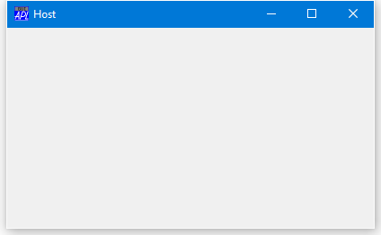

<h1 class="heading"><span class="name"> Docking a Form inside another</span></h1>

The following example illustrates the effect of docking one Form in another.
```apl
      'Host' ⎕WC 'Form' 'Host'
      Host.DockChildren←'Client'
```



```apl
      
      'Client' ⎕WC 'Form' 'Client'
      Client.Dockable←'Always'
```


Notice that a dockable Form is indistinguishable in appearance between any other top-level Form except that it has additional items in its pop-up context (right mouse button) menu as shown.

The following picture shows the effect of dragging the `Client` Form to the top edge of the `Host`, just before the mouse button is released.


The next picture shows the result after docking. The `Client` Form has become a SubForm (white is the default background colour for a SubForm) called `Host.Client`.


The third picture illustrates the effect of docking the `Client` on the left-hand edge.


The following picture shows the `Client` Form docked as a SubForm along the right edge of the `Host` Form.


It is also possible to dock a Form into an already docked Form.
```apl
      'Client2' ⎕WC 'Form' 'Second Client'
      Client2.Dockable←'Always'
```


which we can make dockable in both the `Host` Form and the `Host.Client` SubForm:
```apl
Host.DockChildren Host.Client.DockChildren←⊂'Client2'
```

The next picture shows `Client2` about to be docked in the `Client` SubForm:


And finally, after it has been docked.


