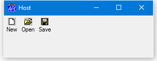

<h1 class="heading"><span class="name">Docking and Undocking a ToolControl</span></h1>

Docking and undocking a ToolControl is handled rather differently from docking and undocking a Form or CoolBand.

When you undock a ToolControl from a Form or SubForm, it cannot remain a ToolControl object, because a ToolControl cannot be a child of Root. Furthermore, its Type cannot simply change to Form because a Form cannot be a parent of a ToolButton. In fact, a ToolButton may **only** be the child of a ToolControl.

Therefore, when a dockable ToolControl is undocked, no action is taken; you have to perform the various operations yourself.

Typically, you would create a new Form to contain the ToolControl and only the ToolControl), and then delete the original.

The new Form should be dockable in the original parent (of the ToolControl), but a callback should intercept this operation and re-instate the ToolControl as a direct child of the host.

Effectively, when you undock a ToolControl, you need to insert a new (floating) Form between the Host Form and the ToolControl. Then when you re-dock it, you need to remove the (floating) Form from the hierarchy.

The following example illustrates the procedure.

The following function creates a Form containing a dockable ToolControl. The ToolControl can be undocked, becoming a floating toolbar, and then docked back into the original Form.
```apl
     ∇ DockableToolControl
[1]    'IL'⎕WC'ImageList'('Masked' 0)
[2]    'IL.'⎕WC'Bitmap'('ComCtl32' 120)⍝ STD_SMALL
[3]    :With 'Host'⎕WC'Form' 'Host'
[4]        Coord←'Pixel'
[5]        Size←50 300
[6]        DockChildren←'Floater'
[7]        onDockAccept←'#.DOCK'
[8]        onDockMove←'#.DOCKMOVE'
[9]        :With 'TC'⎕WC'ToolControl'
[10]           Dockable←'Always'
[11]           onDockRequest←'#.UNDOCK'
[12]           ImageListObj←'#.IL'
[13]           'B1'⎕WC'ToolButton' 'New'('ImageIndex' 7)
[14]           'B2'⎕WC'ToolButton' 'Open'('ImageIndex' 8)
[15]           'B3'⎕WC'ToolButton' 'Save'('ImageIndex' 9)
[16]       :EndWith
[17]   :EndWith
     ∇
```

The picture below shows the initial appearance of the `Host` Form and its ToolControl.



Because the ToolControl is dockable, the user may pick it up and drag it out of its parent Form as shown below.


When the user drops the ToolControl outside the `Host` Form, it (the ToolControl) generates a DockRequest event which is attached to the `UNDOCK` callback function. This function, creates a new Form called `Floater`, makes a copy of the ToolControl as a child of `Floater`, and then expunges the original ToolControl from the `Host` Form. The function, and the results of the operation, are shown below. The following points should be noted.

- The `UNDOCK` callback returns 0 to prevent APL from taking any further action (the default action after a successful DockRequest is to generate a DockAccept event, which in this case is undesirable).
- The `Floater` Form is created as a child of the `Host` Form so that it always floats above it in the window stacking order.
- The `Floater` Form is made dockable so that it can be re-docked back into `Host`.
- The (new) ToolControl is made non-dockable, so that the user cannot drag it out of `Floater`.
```apl
     ∇ R←UNDOCK MSG
[1]    R←0
[2]    :With 'Host.Floater'⎕WC'Form'
[3]        Caption←'Floating ToolControl'
[4]        Dockable←'Always'
[5]        Coord←'Pixel'
[6]        'TC'⎕WC⊃MSG
[7]        TC.Dockable←'Never'
[8]        Size←TC.Size
[9]        Posn←#.Host.Posn+2↑7⊃MSG
[10]   :EndWith
[11]   ⎕EX'#.Host.TC'
     ∇
```


The user may dock the ToolControl back into Host by dragging the `Floater` Form into it.

The `DOCKMOVE` callback function, shown below, prevents the ToolControl (represented by its parent `Floater`) from being docked anywhere except along the top edge.
```apl
     ∇ R←DOCKMOVE MSG
[1]   ⍝ Only allow docking along Top edge
[2]    R←MSG[4]∊'Top' 'None'
     ∇
```

The picture below illustrates the moment just before the user releases the mouse button to dock Floater back into Host.


At this point, the `Host` Form generates a DockAccept event and the callback function `DOCK` is invoked. This function recreates the ToolControl as a child of `Host` (making it dockable once more), and then expunges the `Floater` Form.
```apl
     ∇ R←DOCK MSG
[1]    R←0
[2]    :With ⊃MSG
[3]        'TC'⎕WC ⎕OR(3⊃MSG).TC
[4]        TC.Dockable←'Always'
[5]    :EndWith
[6]    ⎕EX'#.Host.Floater'
     ∇
```

Once again, the result of the callback function is 0 to tell APL that you have dealt with the situation and it is to take no further action.


