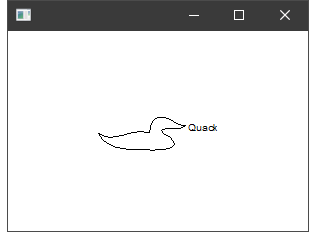

<h1 class="heading"><span class="name">Metafiles</span></h1>

A Windows metafile is a mechanism for representing a picture as a collection of graphics commands. Once a metafile has been created, the picture that it represents can be drawn repeatedly from it. Metafiles are device-independent, so the picture can be reproduced on different devices. Unlike bitmaps, metafiles can be scaled accurately and are therefore particularly useful for passing graphical information between different applications. Note that some other applications only support *placeable* metafiles. See RealSize property for details.

## Creating a Metafile Object

In Dyalog APL, a Windows metafile is represented by the Metafile object. This is created in much the same way as a Bitmap object. That is, you can either make a Metafile object from an existing .WMF file, or you can create an empty one and then draw onto it using Poly, Text and other graphical objects. For example, to create a Metafile object called `Ducky` from the `AN00015_.wmf` metafile that comes with a certain version of Microsoft Office, you can execute the following:
```apl
   Dir←'C:\Program Files\Microsoft Office\root\CLIPART\PUB60COR\'
   'Ducky'⎕WC'Metafile'(Dir,'AN00015_.wmf')
```

If instead you wanted to create a metafile drawing from scratch, you could do so as follows. Notice that there is no need to assign names to the graphical objects drawn onto the Metafile.
```apl
     'METADUCK'  ⎕WC 'Metafile' ''
     'METADUCK.' ⎕WC 'Poly' DUCK
     'fnt'⎕WC'Font' 'Arial' 72
     'METADUCK.'⎕WC'Text' 'Quack'(45 60)('FontObj' 'fnt')
```

## Drawing a Metafile Object

A Metafile object is drawn by specifying either the object itself or its name as the Picture property of another object. This causes the Metafile to be drawn in that object and scaled to fit exactly within its boundaries.

The following statement creates a Form containing the Metafile object  `Ducky`.
```apl

    'F1'⎕WC'Form' ('Size' 50 30) ('Picture' Ducky)
```


The next statement replaces the Picture with the Metafile object `METADUCK`.
```apl
      F1.Picture←METADUCK
```


