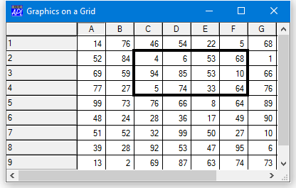

<h1 class="heading"><span class="name">Drawing Graphics on a Grid</span></h1>

You may draw graphics on a Grid by creating graphical objects (Circle, Ellipse, Image, Marker, Poly, Rect and text) as *children* of the Grid.

For the Grid (but only for the Grid) the Coord property may be set to `'Cell'` as an alternative to `'Prop'`, `'Pixel'` or `'User'`. This allows you to easily position graphical objects relative to individual cells or ranges of cells. The origin of the Grid (0,0) is deemed to be the top left corner of the data  (that is, the area inside the row and column titles). In Cell co-ordinates, the value (1,1) is therefore the bottom right corner of the first cell. Regardless of the coordinate system, graphical objects scroll with the data.

The following example illustrates how to draw a box around the cells in rows 2 to 4 and columns 3 to 6.
```apl
 'F'⎕WC'Form' 'Graphics on a Grid'('Coord' 'Pixel')
 'F.G'⎕WC'Grid'(?10 10⍴100)(0 0)F.Size('CellWidths' 40)
 'F.G.L'⎕WC'Rect'(1 2)(3 4)('LWidth' 4)('Coord' 'Cell')
```



The OnTop property of the graphical object controls how it is drawn relative to the grid lines and cell text. For graphical objects created as a child of a Grid, OnTop may be 0, 1 or 2.

|---|-------------------------------------------------------------------|
|0  |Graphical object is drawn behind grid lines and cell text          |
|1  |Graphical object is drawn on top of grid lines but behind cell text|
|2  |Graphical object is drawn on top of grid lines and cell text       |

The following example shows the effect of the OnTop property on how an Image is drawn on a Grid.
```apl
'F'⎕WC'Form' 'Graphics on a Grid'('Coord' 'Pixel')
 'F.G'⎕WC'Grid'(?10 10⍴100)(0 0)F.Size('CellWidths' 40)
 DyalogDir←2 ⎕NQ'.' 'GetEnvironment' 'Dyalog'
 'F.M'⎕WC'Metafile'(DyalogDir,'\WS\DOLLAR')
 'F.G.I'⎕WC'Image'(0 0)('Size' 10 10)('Coord' 'Cell')

 'F.G.I'⎕WS('Picture' 'F.M')('OnTop' 0)
```


```apl
      F.G.I.OnTop←1
```


```apl
      F.G.I.OnTop←2
```


