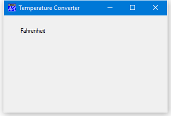

<h1 class="heading"><span class="name">Adding a Fahrenheit Label</span></h1>

We are going to need two edit fields to input and display temperatures and two labels to identify them.

Let's create the "Fahrenheit" label first. It doesn't really matter what we call it because we won't need to refer to it later. Nevertheless, it has to have a name. Let's call it `LF`. We will place it at (10,10) but we don't need to specify its Size; `⎕WC` will make it just big enough to fit its Caption.
```apl
      'TEMP.LF' ⎕WC'Label' 'Fahrenheit'(10 10)
```


