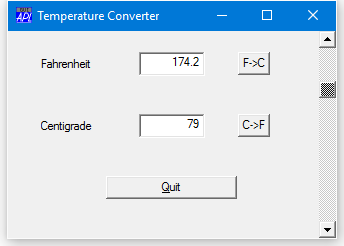

<h1 class="heading"><span class="name">Introducing a ScrollBar</span></h1>

Another way to improve the application would be to allow the user to input using a slider or scrollbar. Let's create one called `'TEMP.S'` ...
```apl
      SCR←'Scroll' ('Range' 101)('Event' 'Scroll' 'C2F')
      'TEMP.S' ⎕WC SCR
```


The range of a scrollbar goes from 1 to the value of the Range property. Setting Range to 101 will give us a range of 1-101. You will see in a moment why we need to do this. The Scroll event will be generated whenever the user moves the scrollbar. We have associated it with the callback function `'C2F'` which we will define as follows:
```apl
     ∇ C2F MSG
[1]   ⍝ Callback for Centigrade input via scrollbar
[2]    TEMP.C.Value←101-4⊃MSG
[3]    TEMP.F.Value←32+TEMP.C.Value÷5÷9
     ∇
```

The Event message `MSG` contains information about the Scroll event. Its 4th element contains the requested thumb position. As we want to go from 0 at the top, to 100 at the bottom, we need to subtract this value from 101. This is done in line 2 of the function. `C2F[3]` calculates the corresponding Fahrenheit value.

Try moving the scrollbar and see what happens...


