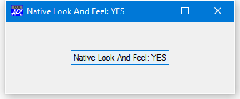
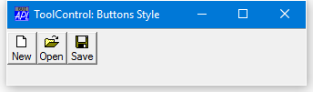

<h1 class="heading">Native Look and Feel</h1>

*Native Look and Feel* is a Dyalog option that affects the appearance of the controls provided by the Dyalog GUI Interface and those used by the Dyalog Session. It is implemented by the **XPLookAndFeel** parameter.

Most of the Dyalog controls (with the notable exception of the Dyalog Grid) are standard Windows user-interface components provided by the Windows Common Controls library `comctl32.dll`. Successive versions of Windows have introduced new versions of the Windows Common Control Library which typically provide additional features as well as certain differences in appearance. However, each version of Windows continues to support older versions of the Common Control Library as well as the latest one. The decision as to which is loaded is made at run-time.

A second factor that affects the appearance of user-interface controls is the application of *Visual Styles*[^1] and Themes. These features enable users to tailor the UI to accommodate their individual needs and preferences. From Windows 8 onwards, the default appearance of certain Common Controls is overridden by the Visual Styles  in use. However, this applies only if *Native Look and Feel* is enabled.

If *Native Look and Feel* is enabled, Windows loads the latest version of `comctl32.dll` (and potentially other Windows dlls) that is appropriate for the version of Windows in use. If *Native Look and Feel* is disabled, an earlier version may be loaded. The specific version that is loaded is not determined by Dyalog, but by Windows.

**The Dyalog for Microsoft Windows Object Reference Guide identifies which features require Native Look and Feel to be enabled. It documents the typical appearance of controls with Native Look and Feel disabled but does not specify how the appearance of controls is affected by enabling Native Look and Feel, which is in any case affected by the Visual Styles selected by the user.**

The following pictures  illustrate the appearance of a simple Button created with and without *Native Look and Feel* under Windows 10.

The next shows the appearance of ToolButttons with Style `Buttons` under Windows 10 with  *Native Look and Feel* disabled. The appearance is the same in earlier versions of Windows.

When *Native Look and Feel* is enabled, the buttons become transparent and Windows applies the Visual Styles associated with the current theme.  This in turn implies that with *Native Look and Feel* enabled the Styles `Button` and `FlatButton` have the same appearance.

[^1]: See msdn.microsoft.com for details.
