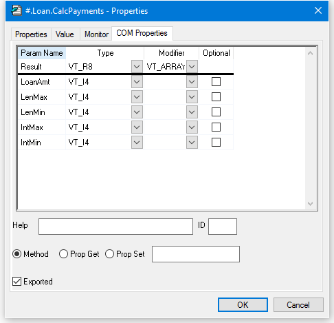

<h1 class="heading"><span class="name">The LOAN Workspace</span></h1>

`LOAN.DWS` contains a single namespace called `Loan` which is used to calculate monthly repayments on a loan. As supplied, LOAN is a pure APL workspace. You will have to turn it into an OLE Server, and declare a method and a property, before you can use it.

The `Loan` namespace contains a single function `CalcPayments` and a variable `PeriodType`.

The `CalcPayments` function takes a 5-element numeric vector as an argument whose elements specify:

1. loan amount 
2. maximum number of periods for repayment
3. minimum number of periods for repayment
4. maximum annual interest rate 
5. minimum annual interest rate

`CalcPayments` also uses the "global" variable `PeriodType` which specifies whether the periods (above) are years or months.  This is done solely to illustrate how another application can manipulate an APL object via its variables (properties) as well as by calling its functions (methods).

`CalcPayments` returns a matrix.  The first row contains the period numbers (from min to max).  The first column contains the interest rates (from min to max in steps of 0.5%). Other elements contain the monthly repayments for the corresponding number of periods and interest rates.

## Using CalcPayments

The following session transcript illustrates how the `CalcPayments` function is used.
```apl
      )LOAD LOAN
C:\...\samples\ole\loan.dws saved ...
 
      )OBS
  Loan
      )CS Loan
#.Loan
      )FNS
CalcPayments
      )VARS
PeriodType
```
```apl

      CalcPayments 10000 5 3 6 3
0     3           4           5        
3   290.8120963 221.3432699 179.6869066
3.5 293.0207973 223.5600105 181.9174497
4   295.2398501 225.7905464 184.1652206
4.5 297.4692448 228.0348608 186.4301924
5   299.708971  230.2929357 188.7123364
5.5 301.959018  232.5647523 191.0116217
6   304.2193745 234.8502905 193.3280153
```

## The CalcPayments Function
```apl
     ∇ PAYMENTS←CalcPayments X;LoanAmt;LenMax;LenMin;IntrMax;
                IntrMin;PERIODS;INTEREST;NI;NM;PER;INT
[1]   ⍝ Calculates loan repayments
[2]   ⍝ Argument X specifies:
[3]        ⍝   LoanAmt     Loan amount
[4]        ⍝   LenMax      Maximum loan period
[5]        ⍝   LenMin      Minimum loan period
[6]        ⍝   IntrMax     Maximum interest rate
[7]        ⍝   IntrMin     Minimum interest rate
[8]   ⍝ Also uses the following global variable (for illustration)
[9]        ⍝   PeriodType  Type of period;1 = years, 2 = months
[10]
[11]   LoanAmt LenMax LenMin IntrMax IntrMin←X
[12]
[13]   PER←PERIODS←¯1+LenMin+⍳1+LenMax-LenMin
[14]   PERIODS←PERIODS×12 1[PeriodType]
[15]   INT←INTEREST←0.5ׯ1+(2×IntrMin)+⍳1+2×IntrMax-IntrMin
[16]   INTEREST←INTEREST÷100×12 1[PeriodType]
[17]
[18]   NI←⍴INTEREST
[19]   NM←⍴PERIODS
[20]
[21]   PAYMENTS←(LoanAmt)×((NI,NM)⍴NM/INTEREST)÷1-1÷(1+INTEREST)∘.*PERIODS
[22]   PAYMENTS←PER,[1]PAYMENTS
[23]   PAYMENTS←(0,INT),PAYMENTS
     ∇
```

## Registering Loan as an OLE Server

To use this example, you **must** first

1. Convert the `Loan` namespace into an OLEServer object.
2. Declare the COM properties for `CalcPayments` and `PeriodType`.
3. Create an in-process or out-of-process server and register the Loan object on your system.

Please perform the following steps:

**On Windows 7 or later, you must start Dyalog APL with Administrator privileges (right-click the desktop icon and choose Run as administrator). This is necessary to register an OLE server.**

`)LOAD` the `loan` workspace from the `samples\ole` sub-directory
```apl
      )LOAD samples\ole\loan
samples\ole\loan saved ...
      )OBS
Loan
```

Execute the following statement to make `Loan` an OLEServer object:
```apl
      Loan.⎕WC 'OLEServer'
```

Next, change space into the `Loan` namespace and use `⎕NL` to display the names of the two objects therein:
```apl
      )cs Loan
#.Loan
      ⎕NL 2 3
CalcPayments
PeriodType  
```

Right-click over the name `CalcPayments` and select *Properties* from the pop-up menu. This brings up the *Properties* dialog box for `Loan.CalcPayments`. Click on the *COM Properties* tab, check the *Exported* box and then fill in the names and data types of its  parameters as illustrated below.



The picture above shows the COM properties that are required to export function `CalcPayments` as a method. The function is declared to require 5 parameters of type VT_I4 (integers) and return a result of type VT_ARRAY of VT_R8 (an array of floating-point numbers).

The names you choose for the parameters will be visible in an object browser and certain other programming environments.

Do the same for the `PeriodType` variable so that it is exported as a  property.


The picture above shows the COM properties to export variable `PeriodType` as a property. The property is declared to be of type VT_I4 (integer).

Rename and save the workspace to avoid overwriting the original:
```apl
      )WSID c:\MyWS\myloan
was C:\Program Files\Dyalog\Dyalog APL-64 15.0 Unicode\Samples\ole\loan.dws
      )SAVE
c:\MyWS\myloan.dws saved...
```

Finally, to create your OLE Server, choose *Export* from the Session *File* menu and complete the *Create bound file* dialog box as shown below. In this case, the OLE Server is created as an in-process server, bound to the development version of the Dyalog APL DLL (because the *Runtime application* checkbox is cleared)


## Using Loan from Excel

Start Excel and load the spreadsheet Loan.xlsm from the Dyalog APL sub-directory `samples\ole`.

The *Payments* button fires a simple macro that uses the APL dyalog.Loan object to perform repayment calculations. To run the example enter data into the cells as shown below, then click *Payments*. When you do so, Excel runs the Calc macro and this causes OLE to initialise the dyalog.Loan OLE Server

The Calc macro actually calculates the repayments matrix by calling the CalcPayments method in the dyalog.Loan object; that is, it runs the `CalcPayments` function in the `Loan` namespace.


## How it Works
```apl
Sub Calc()
    Dim APLLoan As Object
    Dim Payments As Variant
    Set APLLoan = CreateObject("dyalog.Loan")
    LoanAmt = Cells(1, 3).Value
    LenMax = Cells(2, 3).Value
    LenMin = Cells(3, 3).Value
    IntrMax = Cells(4, 3).Value
    IntrMin = Cells(5, 3).Value
    APLLoan.PeriodType = 1
    Payments = APLLoan.CalcPayments(LoanAmt, LenMax,
                           LenMin, IntrMax, IntrMin)
    For r = 0 To UBound(Payments, 1)
        For c = 0 To UBound(Payments, 2)
            Cells(r + 1, c + 5).Value = Payments(r, c)
        Next c
    Next r
End Sub
```

The statement:
```apl
      Dim APLLoan As Object
```

declares a (local) variable called `APLLoan` to be of type Object

The next statement:
```apl
      Set APLLoan = CreateObject("dyalog.Loan")
```

creates an instance of dyalog.Loan associated with this variable.

Effectively, when the macro is run, Excel asks OLE to provide the external object called *dyalog.Loan*.

If you exported `Loan` as an *out-of-process* OLE Server, OLE starts the appropriate version (development or run-time) of Dyalog APL with your workspace `MYLOAN`. If you exported `Loan` as an *in-process* OLE Server, OLE loads MYLOAN.DLL into your Visual Basic application which in turn loads the appropriate Dyalog APL DLL. In either case, an instance of the `Loan` namespace is connected to the Excel macro as an Object.

The next statement to notice is:
```apl
APLLoan.PeriodType = 1
```

In Excel terms, this statement sets the PeriodType property of the APLLoan object to the value 1. What actually happens, is that the APL variable `PeriodType` in the corresponding running instance of the `Loan` namespace is set to 1.

Finally, the following statement:
```apl
Payments = APLLoan.CalcPayments(LoanAmt, LenMax, LenMin,
                                IntrMax, IntrMin)
```

calls the APL function `CalcPayments` and receives the result.

In Excel terms, this statement invokes the CalcPayments method of the APLLoan object.  In practice, it calls the `CalcPayments` APL function with the specified argument and puts the result in the local variable Payments. Note that the conversion between the result of the function (a Dyalog APL floating-point matrix) and the corresponding Excel data type is performed automatically for you.

Notice that the APLLoan variable is local to the Calc macro. This means that the dyalog.Loan object is loaded every time that Calc is run and is unloaded when it terminates.

## Using Loan from Dyalog APL

It is of course possible to use Dyalog APL as both an OLE Automation client and an OLE Automation Server.

To use the dyalog.Loan object, start Dyalog APL and then enter the following expressions in the Session window.

```apl
      'LN'⎕WC'OLEClient' 'dyalog.Loan'
      )OBS
LN
      )CS LN
#.LN
      )METHODS
CalcPayments
      )PROPS
AutoBrowse      ChildList       ClassID ClassName       Data    Event   EventList       Handle  HelpFile
InstanceMode    KeepOnClose     LastError       LateBind        Locale  MethodList      PeriodType      PropList
QueueEvents     Type    TypeList

 
      CalcPayments 10000 5 3 6 3
0     3           4           5        
3   290.8120963 221.3432699 179.6869066
3.5 293.0207973 223.5600105 181.9174497
4   295.2398501 225.7905464 184.1652206
4.5 297.4692448 228.0348608 186.4301924
5   299.708971  230.2929357 188.7123364
5.5 301.959018  232.5647523 191.0116217
6   304.2193745 234.8502905 193.3280153
```

The statement:
```apl
      'LN'⎕WC'OLEClient' 'dyalog.Loan'
```

causes APL to ask OLE to provide the external object called *dyalog.Loan*. This name will have been recorded in the registry by Dyalog APL when you saved the `MYLOAN` workspace.

If you exported `Loan` as an *out-of-process* OLE Server, OLE starts a second Dyalog APL process (development or run-time) with your workspace `MYLOAN`. There are now two separate copies of Dyalog APL running; one is the client, the other the server.

If you exported `Loan` as an *in-process* OLE Server, OLE loads MYLOAN.DLL into the Dyalog APL program which in turn loads the appropriate Dyalog APL DLL. These DLLs are both are loaded into the same address space as the original APL process. In effect, you have two copies of APL (and two workspaces) running as a single program.

Note that in both cases, the mapping between the corresponding functions and variables is direct. Effectively, the client namespace `LN` is an instance of the server namespace `Loan`.
