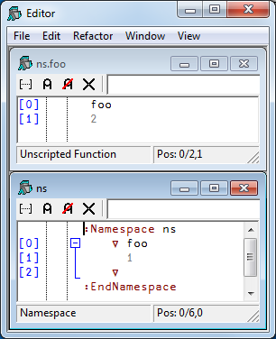

<h1> Namespace Scripts</h1>

A Namespace Script is a script that begins with a `:Namespace` statement and ends with a `:EndNamespace` statement. When a Namespace Script is fixed, it establishes an entire namespace that may contain other namespaces, functions, variables and classes.

The names of Classes defined within a Namespace Script which are parents, children, or siblings are visible both to one another and to code and expressions defined in the same script, regardless of the namespace hierarchy within it. Names of Classes which are nieces or nephews and their descendants are however not visible.

For example:
```apl
:Namespace a

    d←⎕NEW a1
    e←⎕NEW bb2 
    
    :Class a1          
        ∇ r←foo
          :Access Shared Public
          r←⎕NEW¨b1 b2
        ∇
    :EndClass ⍝ a1
    
    ∇ r←goo
      r←a1.foo
    ∇
    
    ∇ r←foo
      r←⎕NEW¨b1 b2
    ∇
    
    :Namespace b
        :Class b1
        :EndClass ⍝ b1
        :Class b2
            :Class bb2
            :EndClass ⍝ bb2
        :EndClass ⍝ b2
    :EndNamespace ⍝ b
    
:EndNamespace ⍝ a
```
```apl

      a.d
#.a.[a1]
      a.e
#.a.[bb2]
      a.foo
 #.a.[b1]  #.a.[b2]
```

Note that the names of Classes `b1` (`a.b.b1`) and `b2` (`a.b.b2`) are not visible from their "uncle" `a1` (`a.a1`).
```apl
      a.goo
VALUE ERROR
foo[2] r←⎕NEW¨b1 b2
```

Notice that Classes in a Namespace Script are fixed before other objects (hence the assignments to `d` and `e` are evaluated *after* Classes `a1` and `bb2` are fixed), although the order in which Classes themselves are defined is still important if they reference one another during initialisation.

A practical example using `:Namespace` is given in the [next topic](namespace-script-example.md).

## Changing Scripted Objects Dynamically

The source of a scripted object can only be altered using the Editor, or by refixing it in its entirety using `⎕FIX`. Dynamic changes to variables, fields and properties, and calling `⎕FX` to generate functions do not alter the source of a scripted object.

Furthermore, if you introduce new objects of any type (functions, variables, or classes) into a namespace or a class defined by a script by any  means other than editing the script, then these objects will be lost the next time the script is edited and fixed.

If you fix a function using `⎕FX` with the same name as a function defined in the script, this new version will supercede the version defined from the script, although the version in the script will remain unchanged.

If you edit the function (as opposed to editing the script) the Editor will show the new version of the function.

If however you edit the script, the Editor will display the original version of the function embedded in the script.

If you were to edit both the script and the function, the Editor would show the two different versions of the function as illustrated in the example that follows.

When you fix the script, the version of the function in the script will replace the one created using `⎕FX`.

<h3 class="example">Example</h3>
```apl
:Namespace ns
    ∇ foo
      1
    ∇
:EndNamespace

      ns.foo
1

      ns.⎕fx 'foo' '2'
      ns.foo
2
      )ed ns.foo ns

```



Note that the Editor displays the description `Unscripted Function` in the status bar of the window showing the new version of `foo`.

Similarly, if you were to Trace the execution of `ns.foo`, the Tracer would display the current (`⎕FX`'ed) version of `foo`, with the same description in its status bar.
