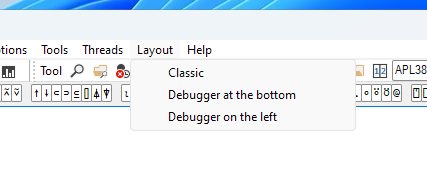
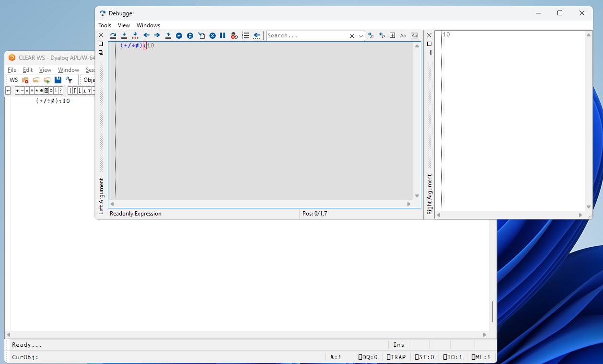
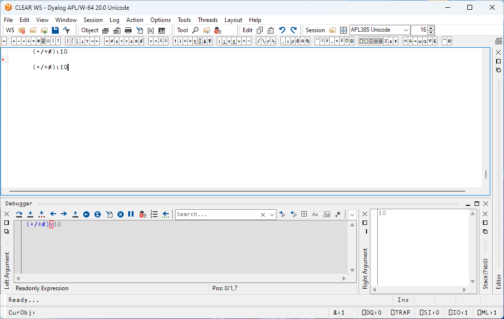
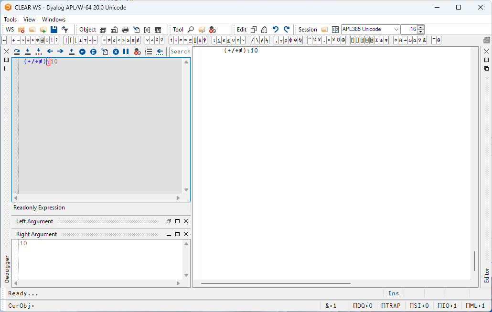
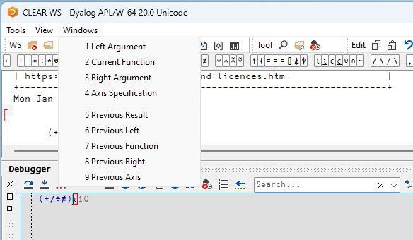
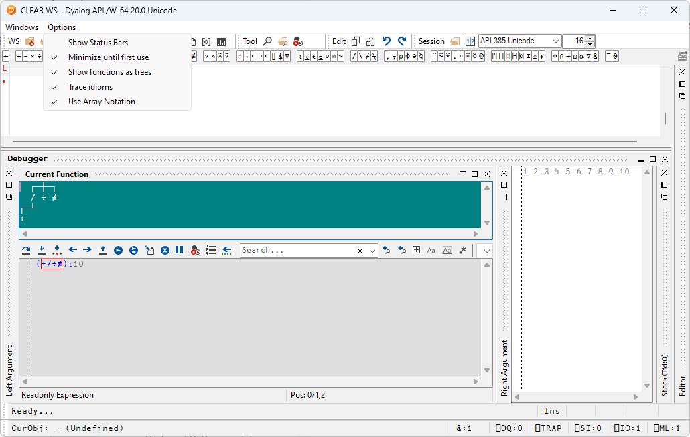

# Anatomy of the TBT Tracer Interface

There are three available layout modes (each of which can be adjusted and configured to taste). They are available under the **Layout** menu:



The layout is a matter of preference; the functionality is the same. The default behaviour is **Debugger at the bottom**. Your choice will be preserved between sessions. The layout options are:

- **Classic**
- **Debugger at the bottom**
- **Debugger on the left**

The **Classic** layout mode detaches the tracer window, allowing it to be placed on a second monitor. 



The **Debugger at the bottom** layout mode:



The **Debugger to the left** layout mode:



In the last two layout modes, the tracer panes are docked into the main window. In all three modes, by default, there are two docked, but minimised panes, named **Left Argument** and **Right Argument**. They will open up automatically as you trace through an expression.

## Aspect Panes

There are several more aspects of an expression that can be inspected in TBT mode beyond the left and right arguments. These are available under the **Windows** menu when in tracing mode:



The aspect pane options are divided into two groups: 1-4, which apply to the *current* function, and 5-9, which apply to the *previously* executed function. They are:

1. **Left Argument**

    The **Left Argument** pane is enabled (but minimised) by default. As you step through an expression, it will display the left argument about to be passed to the highlighted function. 

2. **Current Function**

    The **Current Function** is the one highlighted with the red box in the tracer. Opening a dedicated aspect pane allows you to select different presentation modes, see the section [Aspect Pane Options](#aspect-pane-options) below.

3. **Right Argument**

    The **Right Argument** pane is enabled (but minimised) by default. As you step through an expression, it will display the right argument about to be passed to the highlighted function. 
    
4. **Axis Specification**

    The bracket axis applied to the current function (if any).

5. **Previous Result**
    
    The result of the function evaluation immediately before the one highlighted with the red box. 
    
6. **Previous Left**

    The left argument of the function evaluation immediately before the one highlighted with the red box.

7. **Previous Function**

    The function that was evaluated immediately before the one highlighted with the red box. 

8. **Previous Right**

    The right argument of the function evaluation immediately before the one highlighted with the red box.

9. **Previous Axis**

    The bracket axis applied to the function evaluation immediately before the one highlighted with the red box (if any).

The relationship between these panes can be illustrated as

```other
Left Argument  ┐     ┌─  Axis Specification
               │ ┌─┐ │  ┌──────┬─  Right Argument / Previous Result
               a │B│[1] c D[2] e
                 └┬┘    │ │ │  └  Previous Right
Current Function  ┘     │ │ └  Previous Axis
         Previous Left  ┘ └  Previous Function
```

!!! note 
    Each of these options correspond to a new pane in the tracer. With every such pane enabled and visible, the interface will become busy. A good strategy is to enable these on a case by case basis.

## Aspect Pane Options

The settings available under the **Options** menu can be used to configure the behaviour of the aspect panes. They are:

1. **Show Status Bars**

    This controls the appearance of status bars at the bottom of TBT windows. Changing this only applies to the next time you open the debugger, not to any currently open ones.

2. **Minimise until first use**
    
    This means that if you have saved a tracer layout, the panes should remain minimised until they're activated. This is the default setting. For complex tracer layouts, this can often mean a better use of the screen real estate.

3. **Show functions as trees**

    When using the **Current/Previous Function** panes, **Show functions as trees** uses the same display mode as `]box on -trains=tree`. Default is `]box on -trains=box`. This option can be helpful when dealing with tacit expressions. 

4. **Trace idioms**

    When selected, the TBT tracer will trace _into_ any expression that the interpreter might otherwise optimise out. If not selected, the tracer will instead treat such expressions as atomic functions.
 
5. **Use Array Notation**

    Use APL array notation in the panes for arguments and results, instead of the traditional APL array display.

Here is an illustration of the effect of choosing **Show functions as trees** on the **Current Function** pane:


