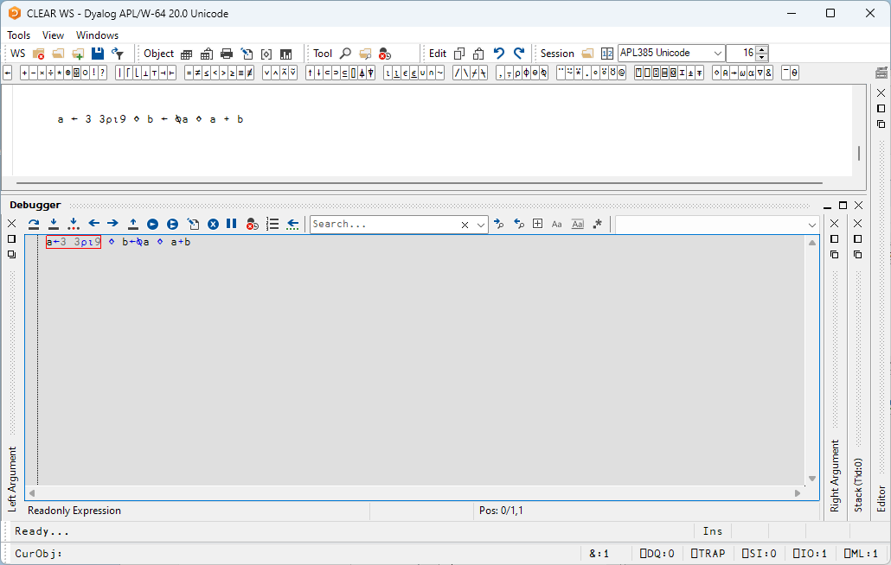
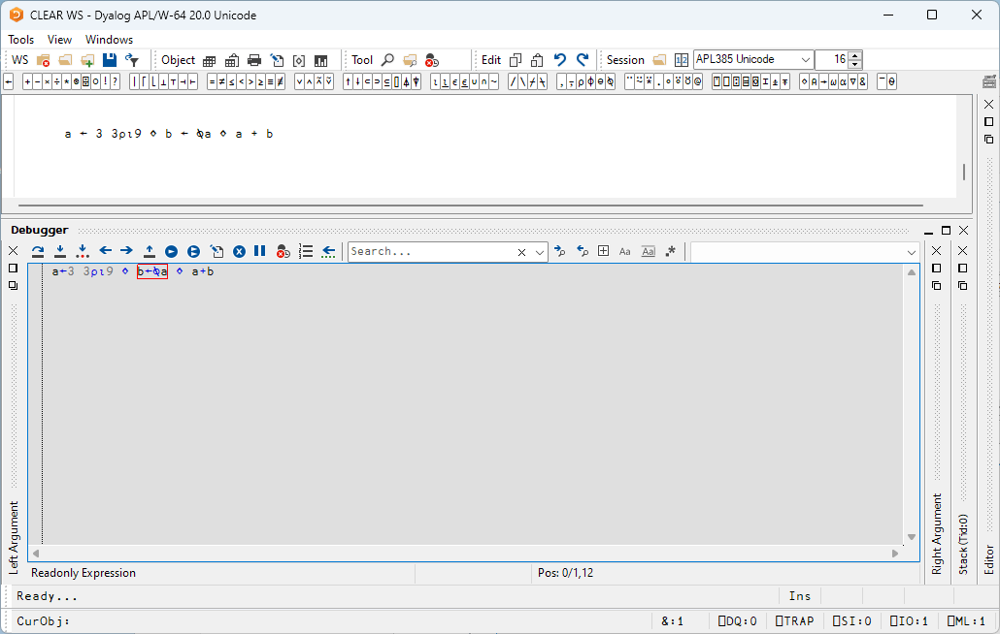
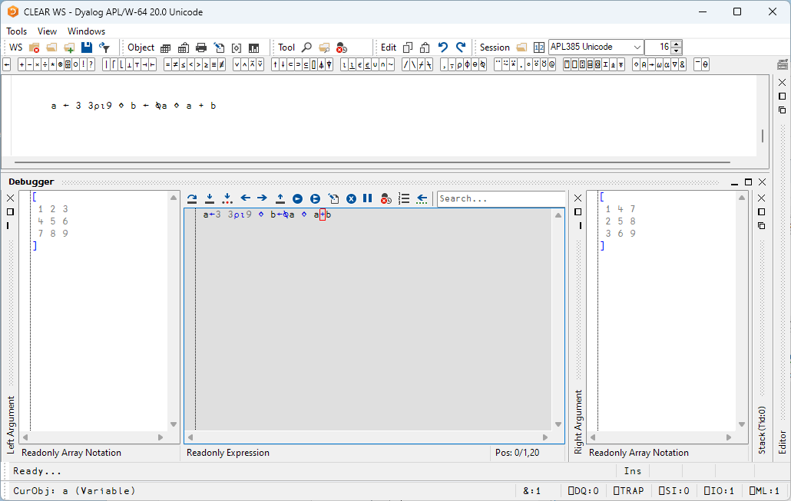

# Tracing Diamond-Separated Expressions

Sometimes you encounter a line of code which is a set of expressions separated by diamonds, but you might only want to TBT into some of them. Consider three diamond-separated expressions, but we want to skip the first two, and TBT-trace into the last expression only:

```apl
a ← 3 3⍴⍳9 ⋄ b ← ⍉a ⋄ a + b
```

Enter the expressions in the session, and commence TBT by hitting <kbd>alt</kbd>+<kbd>shift</kbd>+<kbd>enter</kbd>. You should see:



As you can see, the first expression is highlighted. Now hit <kbd>enter</kbd> to execute the line:



and hit <kbd>enter</kbd> again to skip the middle expression, and then <kbd>alt</kbd>+<kbd>shift</kbd>+<kbd>enter</kbd> to TBT into the final expression:

