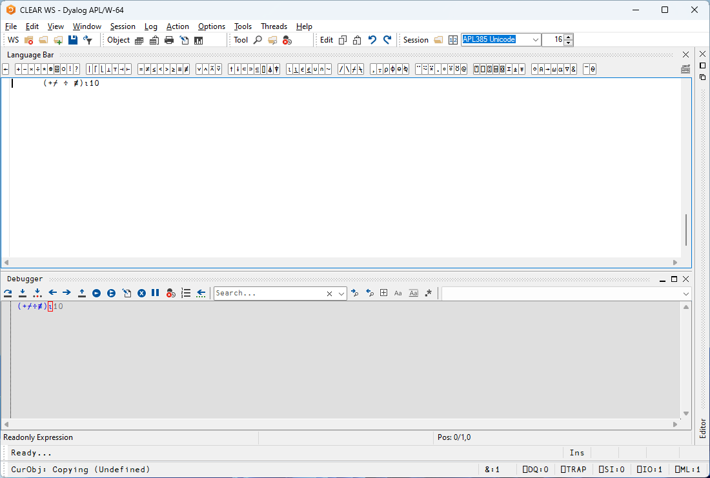

# Introduction

_Token by Token Tracing_ (TBT) is an extension to the tracer that allows the developer to step through the execution of individual primitives of expressions, examining intermediate results and left and right arguments of sub-expressions. It's a powerful addition to the developer's toolbox: it allows for the introspection of complex expressions typed directly into the session, and can be used in conjunction with the traditional tracing mode to skip over lines you're not interested in, and step through primitive by primitive in complex expressions where you need to.

!!! note 
    This document refers to the Microsoft Windows version of Dyalog APL.

## Getting started

There are three primary means of starting a TBT session. Firstly, there is a new key stroke added (Trace Primitive - TP), by default bound to <kbd>shift</kbd>+<kbd>alt</kbd>+<kbd>enter</kbd> (analogous to the <kbd>control</kbd>+<kbd>enter</kbd> used to start a "normal" trace). This key stroke can be used directly in the session. In the session, enter

```apl
(+/÷≢)⍳10
```
and hit <kbd>shift</kbd>+<kbd>alt</kbd>+<kbd>enter</kbd>. You should see:



The little red box surrounding the `⍳` is showing the next primitive to be executed. Keep hitting <kbd>shift</kbd>+<kbd>alt</kbd>+<kbd>enter</kbd> a few times to see how the execution progresses through the tacit expression. 

You can also trace primitives by selecting **Trace Primitives…** from the _Action_ menu:


or by selecting **Action > Trace Primitives…** from the context menu:


The other way of instigating a TP session is to use the new **Next Primitive** symbol in the tracer's toolbar, showing as a downward arrow over three dots:


Let's write a dfn to try this out:

```apl
Arrow ← { ⍝ Draw an arrow head of size ⍵, direction given by ⍺
    ⍺←0
    ⌽⍤⍉⍣⍺∧∘⌽⍨∘.≤⍨⍳⍵
} 
```

```
      1 Arrow 5
┌→────────┐
↓0 0 0 0 1│
│0 0 0 1 1│
│0 0 1 1 1│
│0 0 0 1 1│
│0 0 0 0 1│
└~────────┘
```

Trace into the expression `1 Arrow 5` with <kbd>control</kbd>+<kbd>enter</kbd>. Execute the first line by hitting <kbd>enter</kbd> (or clicking the **Execute Line** symbol in the toolbar) like you normally would. On the next line, you can now use the **Next Primitive** icon to trace through token by token (or use <kbd>
shift</kbd>+<kbd>alt</kbd>+<kbd>enter</kbd>). 


In other words, the **Next Primitive** icon is always present in the tracer. The new key stroke lets you open a tracer on an expression typed directly in the session that previously could not be traced into. 


