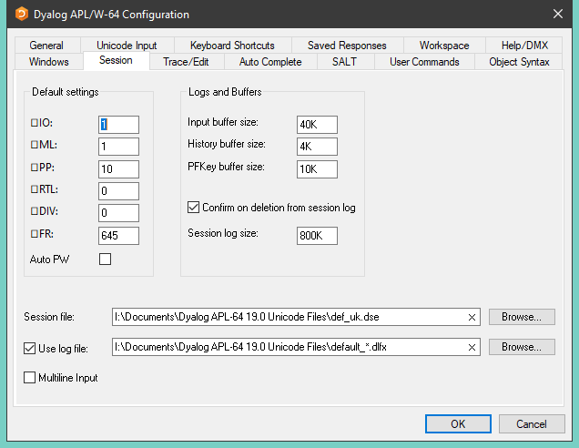

<h1 class="heading">Session Tab</h1>

Table: Configuration dialog: Session

|Label|Parameter|Description|
|---|---|---|
|`⎕IO`|[Default_IO](../../configuration-parameters/default-io.md)|The default value of `⎕IO` in a `clear ws` .|
|`⎕ML`|[Default_ML](../../configuration-parameters/default-ml.md)|The default value of `⎕ML` in a `clear ws`|
|`⎕PP`|[Default_PP](../../configuration-parameters/default-pp.md)|The default value of `⎕PP` in a `clear ws` .|
|`⎕RTL`|[Default_RTL](../../configuration-parameters/default-rtl.md)|The default value of `⎕RTL` in a `clear ws` .|
|`⎕DIV`|[Default_DIV](../../configuration-parameters/default-div.md)|The default value of `⎕DIV` in a `clear ws` .|
|`⎕WX`|[Default_WX](../../configuration-parameters/default-wx.md)|The default value of `⎕WX` in a `clear ws` .|
|Auto PW|[Auto_PW](../../configuration-parameters/auto-pw.md)|If checked, the value of `⎕PW` is dynamic and depends on the width of the Session Window.|
|Input buffer size|[Input_Size](../../configuration-parameters/input-size.md)|The size of the buffer used to store marked lines (lines awaiting execution) in the Session.|
|History size|[History_Size](../../configuration-parameters/history-size.md)|The size of the buffer used to store previously entered (input) lines in the Session|
|PFKey buffer size|[PFKey_Size](../../configuration-parameters/pfkey-size.md)|The size of the buffer used to store PFKey definitions ( `⎕PFKEY` )|
|Confirm on Deletion from Session log|[Confirm_Session_Delete](../../configuration-parameters/confirm-session-delete.md)|Specifies whether or not you are prompted to confirm the deletion of a line from the Session (and Session log).|
|Session log size|[Log_Size](../../configuration-parameters/log-size.md)|The size of the Session log buffer.|
|Session file|[Session_File](../../configuration-parameters/session-file.md)|The name of the Session file in which the definition of your session ( `⎕SE` ) is stored.|
|Use log file|[Log_File_InUse](../../configuration-parameters/log-file-inuse.md)|Specifies whether or not the Session log is saved in a session log file|
|Use log file|[Log_File](../../configuration-parameters/log-file.md)|The full pathname of the Session log file|
|Multiline Input|[Dyalog_LineEditor_Mode](../../configuration-parameters/dyalog-lineeditor-mode.md)|Specifies whether or not multi-line input is enabled in the Session.|

Note: The value of size-related values defined in the above table is specified as an integer value followed by one of K, M, G, T, P or E. The default, where no character is included, is K (Kilobytes).
