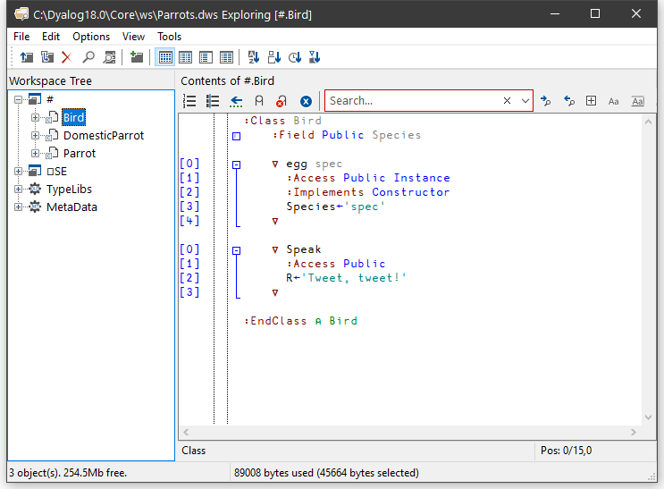

<h1 class="heading">Browsing Classes</h1>

Classes are represented by  icons. The picture below shows 3 classes: `Bird`, `Parrot` and `DomesticParrot`.

If you open the `#` node in the left-hand pane, you see the contents of `#` as a tree.

## Browsing Class Scripts

Selecting `DomesticParrot` in the left-hand pane brings up its Class Script in the right-hand pane.

… and selecting `Parrot` in the left-hand pane brings up the Class Script for `Parrot`.

… and finally, selecting `Bird` in the left-hand pane brings up the Class Script for `Bird`.

If you open a Class node, a tree appears to help you to navigate within the Class script. In the picture below, the user has opened the `[Methods]` node and then clicked on `Speak`. The system has responded by scrolling to (if necessary) and highlighting the appropriate section of the script.

