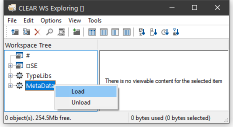

<h1 class="heading"><span class="name">Browsing .NET Classes</span></h1>

Microsoft supplies a tool for browsing .NET Class libraries called `ILDASM.EXE`[^1].

As a convenience, the Dyalog APL Workspace Explorer has been extended to perform a similar task as `ILDASM` so that you can gain access to the information within the context of the APL environment.

The information that describes .NET classes, which is known as its *Metadata*, is part of the definition of the class and is stored with it. This Metadata corresponds to Type Information in COM, which is typically stored in a separate Type Library.

To gain information about one or more .NET Classes, open the Workspace Explorer, right click the *Metadata* folder, and choose *Load*.



This brings up the *Browse .NET Assembly* dialog box as shown below. Navigate to the .NET assembly of your choice, and click *Open*.


The .NET Classes provided with the .NET Framework are typically located in `C:\WINDOWS\Microsoft.NET\Framework64\V4.0.30319` (on a 64-bit computer). The last named folder is the Version number.

The most commonly used classes of the .NET Namespace System are stored in this directory in an Assembly named `mscorlib.dll`, along with a number of other fundamental .NET Namespaces.

The result of opening this Assembly is illustrated in the following screen shot. The somewhat complex tree structure that is shown in the Workspace Explorer merely reflects the structure of the Metadata itself.


Opening the *System/ Classes* sub-folder causes the Explorer to display the list of classes contained in the .NET Namespace *System* as shown in the picture below.


The *Constructors* folder shows you the list of all of the valid constructors and their parameter sets with which you may create a new instance of the Class by calling `New`. The constructors are those named *.ctor*; you may ignore the one named *.cctor*, (the class constructor) and any labelled as *Private*.

For example, you can deduce that `DateTime.New` may be called with three numeric (`Int32`) parameters, or six numeric (`Int32`) parameters, and so forth. There are in fact seven different ways that you can create an instance of a `DateTime`.


For example, the following statement may be used to create a new instance of `DateTime` (09:30 in the morning on 30<sup>th</sup> April 2001):
```apl
      mydt←⎕NEW DateTime (2001 4 30 9 30 0)
 
      mydt
30/04/2001 09:30:00
```

The *Properties* folder provides a list of the properties supported by the Class. It shows the name of the property followed by its data type. For example, the `DayOfYear` property is defined to be of type `Int32`.


You can query a property by direct reference:
```apl
      mydt.DayOfWeek
Monday
```

Notice too that the data types of some properties are not simple data types, but Classes in their own right. For example, the data type of the `Now` property is itself `System.DateTime`. This means that when you reference the `Now` property, you get back an object that represents an instance of the `System.DateTime` object:
```apl
      mydt.Now
07/11/2001 11:30:48
      ⎕TS
2001 11 7 11 30 48 0
```

The *Methods* folder lists the methods supported by the Class. The Explorer shows the data type of the result of the method, followed by the name of the method and the types of its arguments. For example, the `IsLeapYear` method takes an `Int32` parameter (year) and returns a `Boolean` result.
```apl
      mydt.IsLeapYear 2000
1
```


Many of the reported objects are listed as *Private*, which means they are inaccessible to users of the class – you are not able to call them or inspect their value. For more information about classes, see  Object Oriented Programming[Introducing Classes](../../programming-reference-guide/object-oriented-programming/introducing-classes/introducing-classes).


[^1]: ILDASM.EXE can be found in the .NET SDK and is distributed with Visual Studio
