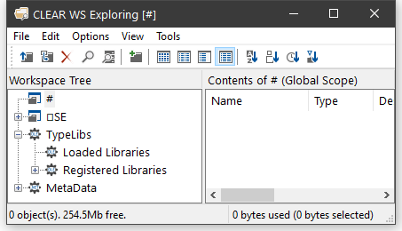
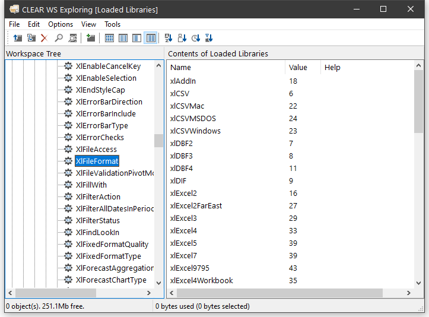

<h1 class="heading"><span class="name">Browsing Type Libraries</span></h1>

When the *View/Type Libraries* option is enabled, the *Workspace Explorer* allows you to:

- Browse the Type Libraries for all the COM server objects that are installed on your computer, whether or not they are loaded in your workspace.
- Load Type Libraries for COM objects
- Browse the Type Library associated with an OLEClient object that is already instantiated in the workspace.

If the Microsoft .NET Framework is installed, you may in addition:

- Load Metadata for specific .NET classes
- Browse the loaded Metadata, viewing information about classes, methods, properties and so forth.

If the *Type Libraries* option is enabled, the *Workspace Explorer* displays a folder labelled *TypeLibs* which, when opened, displays two others labelled *Loaded Libraries* and *Registered Libraries* as shown below.



## Browsing Registered Libraries

If you open the Registered Libraries folder, the *Workspace Explorer* will display in the tree view pane the names of all the Type Libraries associated with the COM Server objects that are installed on your computer.

If you select one of these Library names, some summary information is displayed in the list view pane.

For example, the result of selecting the Microsoft Excel 16.0 Object Library is illustrated below.


If instead, you select the Registered Libraries folder itself, the list of Registered Type Libraries is displayed in the list view pane


## Loading a Type Library

You can load a library shown in the tree view pane by selecting *Load* from its context menu.

In either case, a message box will appear asking you to confirm. The operation to load a Type Library may take a few moments to complete.

Notice that if the selected Library references any other libraries, they too will be loaded. For example, loading the *Microsoft Excel 16.0 Object Library* brings in the *Microsoft Office 16.0 Object Library* and the *Microsoft Visual Basic for Applications Extensibility 5.3 Library* too. It also contains references to a general library called the *OLE Automation Type Library*, so this is also loaded.

When you `)SAVE` your workspace, all of the Type Libraries that you have loaded will be saved with it. Note that type library information can take up a considerable amount of workspace.

## Browsing Loaded Libraries

If you have already loaded any Type Libraries into the workspace, using the Workspace Explorer or as a result of creating one or more OLEClient objects, you can select and open the Loaded Libraries folder.

The picture below illustrates the effect of having loaded the Microsoft Excel 16.0 Object Library.


Notice that any external references to other libraries causes these to be brought in too.

If you select a loaded Type Library, summary information is displayed in the list view pane.

If you open a loaded Type Library, four sub-folders appear named *Object CoClasses*, *Objects*, *Enums* and *Event Sets* respectively.

## Object CoClasses

A Type Library describes a number of *objects*. Typically, all of the objects have properties and methods, but only some of them, perhaps just a few, generate events. Objects which generate events are represented by *CoClasses*, each of which has a pointer to the object itself and a pointer to an event set.

For example, the Microsoft Excel 16.0 Object Library contains seven CoClasses named *Application*, *Chart*, *Global* etc as shown below.


Opening the Application folder you can see that the *Application* CoClass comprises the *_Application* object coupled with the *AppEvents* event set as shown below.


The specific methods, properties and events supported by the CoClass object can be examined by opening the appropriate sub-folder. The same information for these and other objects is also accessible from the *Objects* and *Event Sets* folders as discussed below.

## Objects

The *Objects* folder contains several sub-folders each of which represents a named object defined in the library.

Each object folder contains two sub-folders named Methods and Properties. Selecting one of these causes the list of Methods or Properties to be displayed in the list view pane. The picture below shows the Methods exposed by the Microsoft Excel 16.0 Range object.


If you open the *Methods* or *Properties* subfolder, you can display more detailed information about individual Methods and Properties. For example, the following picture shows information about the *SaveAs* method exposed by the Microsoft Excel 16.0 Worksheet object.


This tells you that the *SaveAs* method takes up to 10 parameters of which the first, Filename, is mandatory and is of data type VT_BSTR (a character string). Note that [in] indicates that the parameter is an *input* parameter.

Incidentally, the optional Fileformat parameter is an example of a parameter whose value must be one of a list of Enumerated Constants. Even without looking at the documentation, the possible values can be deduced by browsing the *Enums* folder, with the results shown below.



You can therefore deduce that the following expression, executed in the namespace associated with the currently active worksheet, will save the sheet in comma-separated format (CSV) in a file called mysheet.csv:
```apl
     SaveAs 'MYSHEET.CSV' xlCSV
```

or
```apl
     SaveAs 'MYSHEET.CSV' 6
```

## Event Sets

The *Event Sets* folder contains several sub-folders each of which represents a named set of events generated by the objects defined in the library.

If you open one of these event sets, the names of the events it contains are displayed in the tree view pane. If you then select one of the events, its details are displayed in the list view pane as shown below.


This example shows that when it fires, the SheetActivate event invokes your callback function with a single argument named *Sh* whose datatype is VT_DISPATCH (in practice, a Worksheet object).

## Enums

The *Enums* folder will typically contain several sub-folders each of which represents a named set of enumerated constants.

If you select one of these sets, the names and values of the constants it contains are displayed in the list view pane as shown below.


