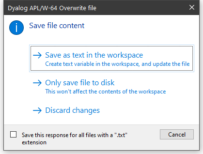

<h1 class="heading"><span class="name">Editing Scripts and Text Files</span></h1>

The Editor may also be used to edit Dyalog script files (`.dyalog` files) and general text files.

There are two ways to choose the file to be edited. If the file exists, you can select it from the *Open source file* dialog by clicking *File/Edit Text File* from the Session menu bar.

Alternatively, type `)ED` followed by the pathname to the file. To identify the name given as a file, it must either contain a slash character ("\" or "/") or be preceded by one.

<h2 class="example">Examples</h2>
```apl
      )ED c:\myfiles\myscript.dyalog
```
```apl
      )ED c:\myfiles\pete.txt

      )ED \x.txt  ⍝ x.txt in current directory

      )ed / x.txt ⍝ ditto

```

If the named file does not exist, you will be asked whether or not you want to create it:


If you edit a Dyalog script file, the editor will treat it as such and provide the same formatting and syntax colouring as if it were a script in the workspace.

Otherwise, the file will be edited as if it were a character vector with embedded new-lines.

When you exit the editor with *Exit and fix*,  you will be offered a number of alternatives depending upon the type of file, as shown below.



Saving a Text file.

Note that if you choose *Save as text in the workspace*, information about the file and the text variable associated with it is retained in the workspace. This information  may be obtained using `5176⌶` and `5177⌶`. See [List Loaded Files](../../language-reference-guide/the-i-beam-operator/list-loaded-files) and [List Loaded File Objects](../../language-reference-guide/the-i-beam-operator/list-loaded-file-objects).


Saving a Script file.

Note that if you choose *Fix as code in the workspace* or *Save as text in the workspace*, information about the file and the text variable associated with it is retained in the workspace. This information  may be obtained using `5176⌶` and `5177⌶`. See [List Loaded Files](../../language-reference-guide/the-i-beam-operator/list-loaded-files) and [List Loaded File Objects](../../language-reference-guide/the-i-beam-operator/list-loaded-file-objects).

# Fix as code in the workspace

If you choose this option, the file will be updated and the script will also be fixed in the workspace. Note that if the script refers to a base class or other external elements, it cannot be fixed unless these elements are also present in the workspace.

## Save as text in the workspace

If you choose this option, the file will be updated and the contents of the file will also be saved to a variable in the workspace. First you will see the following warning dialog, which may be disabled subsequently by checking *Do not ask this question again*.


Then you will be prompted to supply its name, which may be a new name or the name of an existing variable:


## Only save file to disk

If you choose this option, the file will be updated but nothing will be changed in the workspace.

## Discard changes

If you choose this option, all changes will be discarded and nothing saved.
