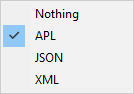
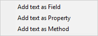
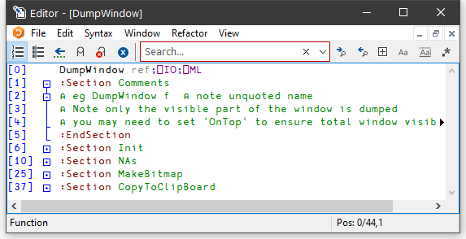

<h1 class="heading"><span class="name"> The Editor</span></h1>

### Invoking the Editor

The editor may be invoked in several ways. From the session, you can use the system command `)ED` or the system function `⎕ED`, specifying the names(s) of the object(s) to be edited. You can also type the name of the object and then press Shift+Enter (ED), click the *Edit* tool on the tool bar, or select *Edit* from the *Action* menu. If you invoke the editor when the cursor is positioned on the empty input line, with a suspended function in the state indicator, the editor is invoked on the suspended function and the cursor is positioned on the line at which it is suspended. This is termed *naked edit*. These ways of invoking the editor apply only in the session window


In addition, there is a general *point-and-edit* facility which works in edit and trace windows too. Simply position the input cursor over a name and double-click the left mouse button. Alternatively, you can press Shift+Enter or select *Edit* from the *File* menu. The name can appear in the Session, in an Edit window, or in a Trace window; the effect is the same. Note that, in the Session, typing a name and pressing Shift+Enter is actually a special case of *point-and-edit*. Note also that a *naked edit* can be invoked by double-clicking the left mouse button in the empty input line.

The type of a new object defaults to function/operator unless the object is shadowed, in which case it defaults to a variable (vector of character vectors). You can however specify the type of a new object explicitly using `)ED` or `⎕ED`. For example, typing "`)ED ∊LIST -MAT`" in a `CLEAR WS` would create Edit windows for a vector of character vectors named `LIST` and a character matrix called `MAT`. See `)ED` or `⎕ED` for details.

If the name is not already being edited, it is assigned a new edit window. If you edit a name which is already being edited, the system *focuses* on the existing edit window rather than opening a new one. Edit windows are displayed using the colour combination associated with the type of the object being edited.

If the name is followed by a line-number in square brackets, e.g. `MyFn[1000]`, the Editor will position the cursor on the specified line. This applies to alll methods of invoking the Editor, except `⎕ED`. There must not be a space between the last character of the name and the "[".

### Window Management (Standard)

Unless *Classic Dyalog mode* is selected (*Options/Configure/Trace/Edit*), the Editor is a Multiple Document Interface (MDI) window that may be a stand-alone window, or be docked in the Session window. Each of the objects being edited is displayed in a separate sub-window. Individual edit windows are managed using standard MDI facilities.


The first edit sub-window window is created at the position specified by the **edit_first_y** and **edit_first_x** parameters which  are specified in terms of the size of a character in the current font relative to the top-left corner of the main Editor window. Subsequent ones are staggered according to the values of the **edit_offset_y** and **edit_offset_x** parameters.

The initial size of an edit window is specified by the **edit_rows** and **edit_cols** parameters.

Note that the blue triangles indicate that the line of text is longer than can be displayed in the current Edit window.

By default, the Session has the Editor docked along the right edge of the Session window. When you edit a function, the Editor window automatically springs into view as illustrated below.


You can resize the Editor pane to view more or less of the Session itself, by dragging its title bar.

Using the buttons in the title bar, you can instantly maximise the Editor pane to allow you to concentrate on editing, or minimise it to reveal the entire Session. In either case, the restore button quickly restores the 2-pane layout.

The picture below shows the effect of maximising the Editor. The `BUILD_SESSION` edit window is itself maximised within the Editor too.


Note that when the Editor has the focus, the Editor menubar is displayed in place of the Session menubar.

### Window Management (Classic Dyalog mode)

If *Classic Dyalog mode* is selected (*Options/Configure/Trace/Edit*) each Edit window is a top-level window created as a child of the Session window. This means that normally Edit windows appear on top of the Session. However, if the **SessionOnTop** parameter is set, the Session window, when given the focus, will appear on top of Edit windows.

When the first Edit window is opened, its position is determined as follows:

- If the **ClassicModeSavePosition** parameter is set, the first Edit window is displayed at the position that was previously occupied by the most recently saved Edit window.
- If not, the first edit window is created at the position specified by the **edit_first_y** and **edit_first_x** parameters which  are specified in terms of the size of a character in the current font relative to the top-left corner of the screen.

The initial size of an edit window is specified by the **edit_rows** and **edit_cols** parameters.


Subsequent ones are staggered according to the values of the **edit_offset_y** and **edit_offset_x** parameters.


#### Moving around an edit window

You can move around in the edit window using the scrollbar, the cursor keys, and the PgUp and PgDn keys. In addition, Ctrl+Home (UL) moves the cursor to the beginning of the top-line in the object and Ctrl+End moves the cursor to the end of the last line in the object. Home (LL) and End (RL) move the cursor to the beginning and end respectively of the line containing the cursor.

#### Closing an edit window

Closing an edit window from its System Menu has the same effect as choosing Exit from the *File* Menu; namely that it fixes the object in the workspace and then closes the edit window.

#### Minimising an edit window

Minimising an edit window causes it to be displayed as a Dyalog APL *Edit* icon, with the name of the object underneath. The edit window can be restored in the normal way, or by an attempt to re-edit the same name.

### Selecting Text

You may select text in an Editor window by clicking the left or right mouse button over any character, dragging out a highlighed area, and then releasing the mouse button. When using the left button, moving up or down one line extends the selection from the beginning of that line, so the selection may be ragged. The right button selects a rectangularr box.

### Editor ToolBar


In the table below, the first image shows the appearance of the toolbutton with Native Look and Feel enabled; the second with it disabled.

| Button | Description |
| --- | ---  |
|   Toggle line numbers | Toggles Line numbers on/off |
|   Toggle tree view | Toggles the treeview on/off. See **Editing Classes** . |
|   Previous Location | Certain operations (such as selecting an item in the treeview)  reposition the caret in the Editor window. This button moves the caret back to its previous location. |
|   Comment selected text | Inserts a comment symbol to the left of the selection in each of the selected lines. |
|   Uncomment selected text | Removes the comment symbol (if present) from the left-most column of the selection in each of the selected lines. |
|   Save changes and return | Saves changes and closes the current edit window |
|   Search Box | Enter search text and click one of the following two buttons |
|   Search for Next Match | Locates the next occurrence of the search text |
|   Search for Previous Match | Locates the previous occurrence of the search |
|   Search hidden text | Determines whether or not the search examines collapsed blocks |
|   Match case | Specifies whether or not the search is case-sensitive |
|   Match whole word | Specifies whether or not the search matches a whole word |
|   Use Regular Expressions | Specifies whether or not the search uses PCRE regular expressions |
|   Refactor text as method | Inserts a Method template for the selected name |
|   Refactor text as field | Inserts a Field template for the selected name |
|   Refactor text as property | Inserts a Property template for the selected name |

### The File Menu


The *File* menu illustrated above is displayed when editing a simple object and provides the following options.

| Item | Description |
| --- | ---  |
| Fix | Fixes the object in the workspace, but leaves the edit window open. Edit history is also preserved. If the data has changed and the **confirm_fix** parameter is set, you will be prompted to confirm. |
| Fix whole script | (Disabled unless editing a script) |
| Open File | Allows you to edit a Dyalog script file or an arbitrary text file. |
| Save | Saves the file being edited. |
| Save As | Renames and saves the file being edited. |
| Always ask on close | Toggles the value of the **confirm_fix** parameter. |
| Edit | Opens an Edit window on the name under the cursor (Disabled when there is no such name). |
| Print | Prints the current contents of the edit window |
| Print Setup | Displays the *Print Configuration* dialog box |
| Properties | Displays the *Object Properties* dialog box for the current object |
| Exit (and Fix) | Fixes the object in the workspace and closes the edit window. If the data has changed and the confirm_exit parameter is set, you will be prompted to confirm |
| Exit (and fix script) | (Disabled unless editing a script) |
| Exit and discard changes | Closes the edit window, but does not fix the object in the workspace. If the data has changed and the **confirm_abort** parameter is set, you will be prompted to confirm. |

### The File Menu (editing a script)


| Fix whole script | Fixes the entire script |
| --- | ---  |
| Fix only functions | Fixes only the functions in the script. |
| Exit and fix whole script | Fixes the entire script, and exits the Editor. |
| Exit and fix only functions | Fixes only the functions in the script and exits the Editor. |

#### Editing Scripts

Suppose that you have a Class that manages a list of items in a shared Field, so somewhere in the script would appear a line such as:-
```apl
     :Field shared public List←⍬
```

You run your application for a bit, and `List`, which was initially empty, gets updated as new instances of the Class are created. You then edit the Class to add a new function, or fix a bug. In this instance, when you exit the editor you **may not** want `List` to be reset back to the empty vector although you **do want** the new version of the function(s) in the Class to be fixed.

Nevertheless whenever you edit the Class *when it is not suspended*, you probably always want the entire script to be re-fixed, and `List` re-initialised.

The options in the *File* menu shown above provide for these alternatives.

In addition, the Configuration Dialog (see [Fixing Scripts](configuration-dialog.md)) allows you to define  the behaviour of the keystrokes <EP> and <S1> for both the suspended case and the non-suspended case. This association will be displayed against the appropriate action according to the state of the script you are editing.

### The Edit Menu

The *Edit* menu provides a means to execute those commands that are concerned with editing text. The Edit menu and the actions it provides are described below.


| Item | Description |
| --- | ---  |
| Reformat | Reformats the function body in the edit window, indenting control structures as appropriate. |
| Reformat Scripts Automatically | If checked, the Editor will automatically reformat a Dyalog script when it loads it. |
| Undo | Undoes the last change made to the object. Repeated use of this command sequentially undoes each change made since the edit window was opened. |
| Redo | Re-applies the previous undone change. Repeated use of this command sequentially restores every undone change. |
| Select All | Selects and highlights the entire contents of the Edit window. |
| Cut | Copies the selected text to the clipboard and removes it from the object. |
| Copy | Copies the selected text to the clipboard. |
| Paste | Copies the text in the clipboard into the object at the current location of the input cursor. |
| Paste Unicode | Same as *Paste* , but gets the Unicode text from the clipboard and converts to `⎕AV` |
| Paste Non-Unicode | Same as *Paste* , but gets the ANSI text from the clipboard and converts to `⎕AV` . |
| Clear | Deletes the selection or the character under the cursor. Has no effect on the clipboard |
| Open Line | Inserts a blank line immediately below the current one. |
| Delete Line | Deletes the current line. |
| Goto Line | Prompts for a line number, then positions the cursor on that line. |
| Find | Displays the *Find* dialog box. |
| Replace | Displays the *Replace* dialog box. |
| Highlight All Matches | If checked, all strings in the object being edited that match the search string are highlighted. The highlightedted items change dynamically as the search string is entered or changed. |
| Comment selected lines | Adds a comment symbol to the beginning of all selected lines. |
| Uncomment selected lines | Removes a comment symbol from the beginning of all selected lines. |
| Toggle Local name | Adds or removes the name under the cursor to/from the function header line. |

The *Find* and *Replace* items are used to display the *Find* dialog box and the *Find/Replace* dialog box respectively. These boxes are used to perform search and replace operations and are described later in this Chapter.

Once displayed, each of the two dialog boxes remains on the screen until it is either closed or replaced by the other. This is convenient if the same operations are to be performed over and over again, and/or in several windows. *Find* and *Find/Replace* operations are effective in the window that previously had the focus.

### The Syntax Menu



The *Syntax* menu illustrated above provides options to specify  how the data displayed in the Editor window is to be syntax coloured. For workspace objects, the default is *APL* for functions and operators, and *Nothing* for variables.

| Item | Syntax Colour as |
| --- | ---  |
| Nothing | Variable |
| APL | Function |
| JSON | JSON array |
| XML | XML array |

### The Window Menu

The *Window* menu provides a means to control the display of the various edit windows. The *Window* menu and the actions it provides are described below.


| Item | Description |
| --- | ---  |
| Close All Windows | Closes all the edit windows. If *Confirm on Edit Window Closed* is checked, you will be prompted to confirm for any objects that you have changed. |
| Cascade | Arranges the edit windows in overlapping fashion. |
| Tile Vertically | Arranges the edit windows tiled one above the other. |
| Tile Horizontally | Arranges the edit windows tiled alongside one another. |
| Arrange Icons | Arranges any minimised edit windows. |
| Editor | Allows you to Select the edit window corresponding to the named object. |

### The Refactor Menu



The *Refactor* menu illustrated above applies only when editing a Class and provides the following options. In each case, the user must highlight a name in the Edit window, and then select one of these options to insert the appropriate template for that name into the body of the Class.

| Item | Description |
| --- | ---  |
| Add text as Field | Inserts a Field template for the selected name. |
| Add text as Property | Inserts a Property template for the selected name. |
| Add text as Method | Inserts a Method template for the selected text name. |

### The View Menu


The *View* menu, illustrated above, provides the following actions.

| Item | Description |
| --- | ---  |
| Trace | Displays a column to the left of the function that displays `⎕TRACE` settings |
| Stop | Displays a column to the left of the function that displays `⎕STOP` settings |
| Monitor | Displays a column to the left of the function that displays `⎕MONITOR` settings |
| Line Numbers | Toggles the display of line numbers on/off. |
| Function Line Numbers | Toggles the display of line numbers on *individual functions* on/off. This option is only enabled when editing a Class, Namespace script or Interface. |
| Tree View | Toggles the display of the treeview in the left-hand pane. |
| Compiler Errors | If enabled, the Editor identifies which lines of code would not compile. These are identified by a red vertical line to the left. Hovering over the red bar gives you a pop-up telling you what the compiler didn't like about that line of the function. |
| Outlining | Turns outlining on and off. |
| Expand All Outlines | Expands all outlines. |
| Collapse All Outlines | Collapses all outlines |
| Expand all Outlines below here | Expands all outlines below the level of the current line. |

#### Function Line Numbers

The *Function Line Numbers* option in the Editor menu provides an additional level of line-numbering. If selected, line numbers are displayed *independently* on each individual function (or operator) in the Class. This option is only enabled when you are editing a Class, Namespace script or Interface, and is disabled for all other types of object.

Note that function line-numbering and general line-numbering are independent options and it is possible to have the entire Class numbered (from [0] to the number of lines in the Class) in addition to having line-numbering on each individual function.

### Using the Editor

#### Creating a New Function

Type the name of your function and invoke the editor. To do this you may press Shift+Enter, or select *Edit* from the *Action* menu, or double-click the left button on your mouse, or click the *Edit* tool in the tool bar. A new window will appear on the screen with the name you have chosen displayed in the top border. The name is also inserted in the function header and the cursor positioned to the right. The new window is automatically given the input focus.

#### Line-Numbers on/off

Try changing the line numbers setting by clicking on the *Line Numbers* option in the *Options* menu. Note that line-numbering on/off is effective for **all** edit windows.

#### Adding Lines

If the keyboard is in *Insert* mode, pressing Enter at the end of a line opens you a new blank line under the current one and positions the cursor there ready for input. You can also open a new blank line by pressing Ctrl+Shift+Insert (OP).

If the cursor is at the end of the last line in the function, pressing Enter adds another line even if the keyboard is in Replace mode.

#### Indenting Text

Dyalog APL allows you to insert leading spaces in lines of a function and (unless the **AutoFormat** parameter is set) preserves these spaces between editing sessions. Embedded spaces are however discarded. You can enter spaces using the space bar or the Tab key. Pressing Tab inserts spaces up to the next tab stop corresponding to the value of the **TabStops** parameter. If the **AutoIndent** parameter is set, new lines are automatically indented the same amount as the preceding line.

#### Reformatting

The RD command (which by default is mapped to Keypad-Slash) reformats a function according to your **AutoFormat** and **TabStops** settings. See [ Trace/Edit Tab](configuration-dialog.md).

#### Deleting Lines

To delete a block of lines, select them by dragging the mouse or using the keyboard and then press Delete or select *Clear* from the *Edit* menu. A quick way to delete the current line without selecting it first is to press Ctrl+Delete (DK) or select *Delete Line* from the *Edit* menu.

#### Copying Lines

Select the lines you wish to copy by dragging the mouse or using the keyboard. Then press Ctrl+Insert or select *Copy* from the *Edit* menu. This action copies the selection to the clipboard. Now position the input cursor where you wish to make the copy and press Shift+Insert, or select *Paste* from the *Edit* menu. You can also use this method to duplicate a ragged block of text.

To copy text using drag-and-drop editing:

1. Select the text you want to move.
2. Hold down the Ctrl key, point to the selected text and then press and hold down the left mouse button. When the drag-and-drop pointer appears, drag the cursor to a new location.
3. Release the mouse button to drop the text into place.

#### Moving Lines

Select the lines you wish to copy by dragging the mouse or using the keyboard. Then press Shift+Delete or select *Cut* from the Edit menu. This action copies the selection to the clipboard and removes it. Now position the input cursor at the new location and press Shift+Insert, or select *Past*e from the Edit menu. You can also use this method to move a *ragged* block of text.

To move text using drag-and-drop editing:

1. Select the text you want to move.
2. Point to the selected text and then press and hold down the left mouse button. When the drag-and-drop pointer appears, drag the cursor to a new location.
3. Release the mouse button to drop the text into place.

#### Joining and Splitting Lines

To join a line to the previous one: select Insert mode; position the cursor on the first character in the line; press Bksp.

To split a line: select Insert mode; position the cursor at the place you want it split; press Return.

#### Toggling Localisation

The TL command (which by default is mapped to Ctrl+Up) toggles the localisation of the name under the cursor. If the name is currently global, pressing Ctrl+Up causes the name to be added to the list of locals in the function header. If the name is already localised, pressing Ctrl+Alt+l removes it from the header.

#### Matching Occurences

When you position the caret over a name, control word, or simple text or to the right of a parenthesis, bracket, or brace, matching occurrences are identified (by a thin box). In particular :

- matching occurrences of the word under the caret (except the actual instance under the caret)
- matching parentheses, brackets and braces
- all control words associated with the one under the caret. For example, if the caret is on `:If`, then nested `:AndIf`, `:OrIf`, `:Else` and the final `:Endif` are identified.

#### Aligning Comments

When you press the <AC> key, or select Align Comments in the Editor's context menu, the alignment of the comments in every line in the function will be changed so that the left-most comment (Lamp) symbol is in the same column as the cursor, except that:

- Comment symbols that are preceded only by white space, i.e. comments in lines that contain no code, are ignored and are not adjusted in any way.
- Comment symbols that lie between the first column and the first tab stop will remain in or be moved to the first column. For information on setting tab stops, see 

Installation & Configuration Guide:

Configuration Dialog (Edit/Trace Tab).
- Comment symbols will not move further left than the end of the statement.

When a comment is re-aligned, text to the right of the left-most comment symbol (including spaces and other comment symbols) will remain fixed in relation to  that symbol.

Note that there is no keystroke associated with this command by default; the user must define one. See 
Installation & Configuration Guide: 

Configuration Dialog (Keyboard Shortcuts Tab).

#### Stop, Trace and Monitor Controls

If any of the *Stop*, *Trace*, and *Monitor* options of the *View* menu are set, the Editor displays  an area to the left of the function body containing up to 3 columns. If a function line is enabled by `⎕TRACE`,`⎕STOP` or `⎕MONITOR` the corresponding column displays a yellow circle (trace), red circle (stop) or clock symbol (monitor).


When you move the mouse-pointer over this area, the pointer displays the appropriate symbol and you can toggle the corresponding setting on and off by clicking the mouse.

### White Space in Source Code

Settings that impact the automatic reformatting of code can cause changes to whitespace – this can be interpreted as changes to the source code. This means that:

- opening a scripted object in the Edit window can cause the source of that object to change (when closing an Edit window, you might be prompted to save a function even though you have not made any changes to it).
- viewing an object can change its file timestamp; source code management systems can subsequently report changes due to the changed file timestamp.
- source code changes resulting from reformatting will be evident in the results of system functions such as `⎕AT`, `⎕SRC`, `⎕CR`, `⎕VR` and `⎕NR`.

### Outlining

When you are editing a function, outlining identifies the blocks of code within control structures, and allows you to collapse and expand these blocks so that you can focus your attention on particular parts of the code

The picture below shows the result of opening the function `⎕SE.cbtop.TB_POPUP`.
```apl
      )ed ⎕SE.cbtop.TB_POPUP
```


Notice that the various control structure blocks are delineated by a treeview diagram.

- When you hover the mouse pointer over one of the boxes that mark the start of a block, the line marking the extent of that block becomes highlighted, as shown above.
- If you click on a  box, the corresponding section collapses, so that only the first line of the block is displayed, as shown below.
- If you click on a   box, the corresponding section is expanded.


### Sections

Functions and scripted objects (classes, namespaces etc.) can be subdivided into Sections with `:Section` and `:EndSection` statements. Both statements may be followed by an optional and arbitrary name or description. The purpose is to split the function up into sections that you can open and close in the Editor, thereby aiding readability and code management. Sections have no effect on the execution of the code, but must follow the nesting rules of other control structures.

The following picture illustrates the use of sections in a function called `DumpWindow`. The function is divided into 5 sections named `Comments, Init`, `NAs, MakeBitmap` and `CopyToClipBoard`.

The first picture shows the function with all sections closed.


The next picture shows the effect of opening the *Comments* section. Notice how this is delineated by the statements:
```apl
      :Section Comments
      ...
      :EndSection Comments
```



And with the `Init` section opened too:


Finally, with all the sections opened:


### Editing Classes

The picture below shows the result of opening the `ComponentFile` class. Notice how each function is delineated separately and that each function is individually line-numbered.
```apl
      )ed ComponentFile
```


The outlining feature really comes into its own when editing classes because you can collapse and expand whole functions. The picture below shows the effect of collapsing all but the `Append` method.


When you edit a class, a separate treeview is optionally displayed in the left pane to make it easy to navigate within the class. When you click on a name in the treeview, the editor automatically scrolls the appropriate section into view (if necessary) and positions the edit cursor at its start. The picture below illustrates the result of opening the `[Methods]` section and then clicking on *Rename*.


### Sections within Scripts

Scripts can also be subdivided into Sections using `:Section` and `:EndSection` statements. As with single functions, the purpose is only to split the script up into sections that you can open and close in the Editor. Sections have no effect on the execution of the code.

The following picture illustrates a Class named `actuarial` which, for editing purposes, has been sub-divided into five separate Sections named `Main`, `MenuHandlers`, `Validation`, `Utilities` and `OldCode`. In this picture, all the Sections are closed.


The next picture shows the effect of opening just the `Main` section.


Notice that this section is delimited by the two statements:
```apl
      :Section Main
      ...
      :EndSection Main
```

In this picture the 3 functions within the `Main` section are temporarily closed.

Similarly, the section called `Validation` is delimited by:
```apl
      :Section Validation
      ...
      :EndSection Validation
```


