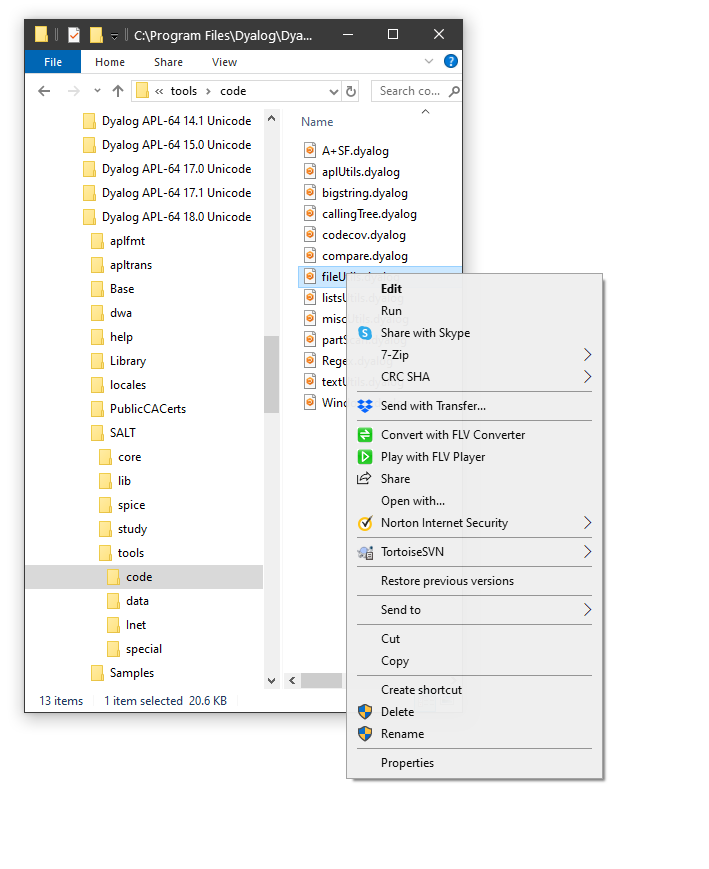

<h1 class="heading"><span class="name">File Explorer Integration</span></h1>

## File Associations

During installation, Dyalog establishes the following file associations:

|Type         |File Extension                              |Application                                           |
|-------------|--------------------------------------------|------------------------------------------------------|
|Shell Scripts|`.apls`                                     |Dyalog script execution engine via Windows Power Shell|
|Sources      |`.aplc, .aplf, .apli, .apln, .aplo, .dyalog`|Dyalog Editor                                         |
|Configuration|`.dcfg`                                     |Dyalog Editor                                         |
|SALT apps    |`.dyapp`                                    |Dyalog                                                |
|Workspaces   |`.dws`                                      |Dyalog                                                |

When you double-click on a file with one of the above extensions, the file is opened with the corresponding application.

In addition, two items are added to the Windows Explorer context menu for directories, namely *Load with Dyalog* and *Run with Dyalog*. Both these items start Dyalog and attempt to import code from the corresponding directory using Link. The *Run with Dyalog* option also calls the function named `Run` if it exists. See [Load Parameter](../../windows-installation-and-configuration-guide/configuration-parameters/load).

For more information about Link, see [https://dyalog.github.io/link/](https://dyalog.github.io/link/).

The `]fileAssociations` user command may be employed to alter these settings. For details, enter:
```apl
      ]fileassociations -?
```

## Browsing Workspaces and Source Files

### (Unicode Edition Only)

You can browse the contents of workspaces and Dyalog source files using the preview pane of Windows File Explorer. The following example show what you see in the preview pane when you select the supplied workspace `ddb.dws`.


When you move the cursor to the next workspace in the list, `dfns.dws`, the preview pane is immediately updated to show its contents.


If you open the Fns/Ops node and click on a function name, the function is displayed. The next picture shows the function `assign`.


You can also browse Dyalog source files. The following picture shows what you see when you select the `fileUtils.dyalog` file.


Note that you may only *view*  workspace objects and scripts in the preview pane, it is not possible to *edit* them in the preview pane.

### Editing Dyalog Source Files

You may edit a source file from File Explorer by first selecting the source file and then choosing *Edit* from the File Explorer context menu.



This brings up the standard Dyalog Editor, in a stand-alone window, just as it would appear if undocked from the Session, as shown in the next picture.


