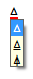

<h1 class="heading"><span class="name">Configuring the Dyalog IME</span></h1>

The Dyalog Unicode IME is added as an additional service to all keyboards defined to the user and the administrator at the time that the IME was installed.

For each IME the underlying keyboard layout file will be the same as that defined for the base keyboard. The layout file is a DLL created by Microsoft.

The language specified in the description of the IME is the name of the IME translate table that has been associated with the IME for the specific keyboard. In the case of languages not supported by the IME the keyboard will default to en-US.

## IME Properties

To change the properties of the IME go to  *Options/Configure/Unicode Input* tab and select
 *Configure Layout*:


## Input translate table

The translate table defines the mapping between APL characters and the keystrokes that generate those APL characters. It is possible to alter the mapping or to create support for new keyboards by altering the translate table, or by selecting a different translate table. See the *IME User Guide* for more details.

## Backtick Keyboard

The *Backtick* keyboard provided by Ride may be used natively. By default it is disabled. To enable it, check the box labelled *Enable Backtick Keyboard introducer*. You may replace the backtick character (```) with an alternative character to act as the introducer for APL glyphs, but take care to choose a character that is otherwise unused.

For information on using this keyboard interface, see [Ride User Guide](https://dyalog.github.io/ride).

## Overstrikes

In the original implementations of APL, many of the special symbols could only be generated by overstriking one character on top of another as is reflected in the appearance of the glyphs. For example, the symbol for Grade Up (`⍋`) is actually the symbol for delta (`∆`) superimposed on the symbol for vertical bar (`|`)

In Dyalog, such symbols can be generated either by a single keystroke, or (in *Replace* mode) by overtyping one symbol with another. For example `⍋` may be generated using Shift+Ctrl+4, or by switching to *Replace* mode and typing the three keystrokes Ctrl+h, Left-Cursor, Ctrl+m.

Using the Dyalog Unicode IME the character can also be entered by pressing Ctrl+Bksp, Ctrl+m, Ctrl+h. Note that Ctrl+Bksp is the default *Overstrike Introducer Key* (key code
OS).

## Use Overstrike popup

With this option selected, when the character following the Overstrike Introducer Key is pressed, a popup box displays all the overstrikes which contain the last character typed: in the example below Ctrl+Bksp has been followed by Ctrl+h:



Note the fine (red) line under the `∆`. This indicates that an overstrike creation operation is in progress.

The input of the symbol `⍋` can be completed by pressing Ctrl+m, or by moving the selection up and down the pop-up list using Cursor-Up or Cursor-Down.

## Overstrikes do not require the OS introducer key

With this option selected, the IME identifies characters which are part of a valid overstrike, and when such a character is entered into the session, begins an overstrike creation operation.
