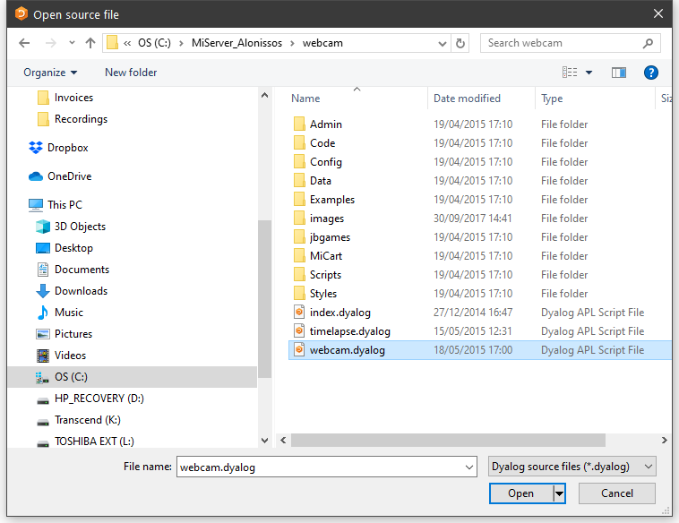
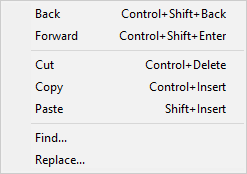
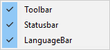
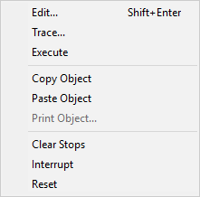

<h1 class="heading">The Session MenuBar</h1>

The Session MenuBar  (`⎕SE.mb`) contains a set of menus as follows. Note that, unless specified, the screen-shots are taken using Unicode Edition and the keyboard short-cuts will be different in Classic Edition.

## The File Menu

The *File* menu (`⎕SE.mb.file`) provides a means to execute those APL System Commands that are concerned with the active and saved workspaces. The contents of a typical File menu and the operations they perform are illustrated below.

Table: File Menu Operations { #file-menu-operations }

|Item|Action|Description|
|---|---|---|
|New|[WSClear]|Prompts for confirmation, then clears the workspace|
|Open|[WSLoad]|Prompts for a workspace file name, then loads it|
|Copy|[WSCopy]|Prompts for a workspace file name, then copies it|
|Save|[WSSave]|Saves the active workspace|
|Save As|`[WSSaveas]`|Prompts for a workspace file name, then saves it|
|Export|`[Makeexe]`|Creates a bound executable, an OLE Server, an ActiveX Control, or a .NET Assembly. See [Creating Executables and COM Servers](../../windows-installation-and-configuration-guide/creating-executables) .|
|Export to Memory|`[MakeMemoryAssembly]`|Creates an *in-memory* .NET Assembly|
|Close AppDomain|`[CloseAppDomain]`|Closes .NET App Domain|
|Drop|`[WSDrop]`|Prompts for a workspace file name, then erases it|
|Edit Text File|`[EditTextFile]`|Displays the *Open Source File dialog* to select a file to exit.|
|Print|`[PrintFnsInNS]`|Prints functions and operators in current namespace|
|Print Setup|`[PrintSetup]`|Invokes the print set-up dialog box|
|Continue|`[Continue]`|Saves the active workspace in CONTINUE.DWS and exits APL|
|Exit|`[Off]`|Exits APL|

## Edit Text File

The Edit Text File menu item allows you to edit a Dyalog script file (.dyalog) or an arbitrary text file. The system prompts you to choose the file as shown below:

The file is then displayed in the Editor, allowing you to change it and save it. See [Editing Scripts and Text Files](editing-scripts-and-text-files.md).

## The Edit Menu

The *Edit* menu (`⎕SE.mb.edit`) provides a means to recall previously entered input lines for re-execution and for copying text to and from the clipboard.

**Unicode Edition**

**Classic Edition**

Table: Edit menu operations { #edit-menu-operations }

|Item             |Action          |Description                                                                               |
|-----------------|----------------|------------------------------------------------------------------------------------------|
|Back             |`[Undo]`        |Displays the previous input line. Repeated use of this command cycles back through the input history.|
|Forward          |`[Redo]`        |Displays the next input line. Repeated use of this command cycles forward through the input history.|
|Cut              |`[Delete]`      |Cuts the selected text to the clipboard|
|Copy             |`[Copy]`        |Copies the selection to the clipboard|
|Paste            |`[Paste]`       |Pastes the text contents of the clipboard into the session log at the current location. The new lines are *marked* and may be executed by pressing Enter.|
|Paste Unicode    |`[PasteUnicode]`|Same as *Paste* , but gets the Unicode text from the clipboard and converts to `⎕AV` . **Classic Edition only**|
|Paste Non-Unicode|`[PasteAnsi]`   |Same as *Paste* , but gets the ANSI text from the clipboard and converts to `⎕AV` . **Classic Edition only**|
|Find             |`[Find]`        |Displays the *Find* dialog|
|Replace          |`[Replace]`     |Displays the *Find/Replace* dialog box |

## The View Menu

The *View* menu (`⎕SE.mb.view`) toggles the visibility of the Session Toolbar, StatusBar, and Language Bar.

Table: View menu operations { #view-menu-operations }

|Item       |Action|Description                   |
|-----------|------|------------------------------|
|Toolbar    |&nbsp;|Shows/Hides Session toolbars  |
|Statusbar  |&nbsp;|Shows/Hides Session statusbars|
|LanguageBar|&nbsp;|Shows/Hides Language Bar      |

## The Window Menu

This contains a single action (`⎕SE.mb.windows`) which is to close all of the Edit and Trace windows and the Status window.

Table: Window menu operations { #window-menu-operations }

|Item             |Action      |Description                      |
|-----------------|------------|---------------------------------|
|Close all Windows|`[CloseAll]`|Closes all Edit and Trace windows|

Note that `[CloseAll]` removes all Trace windows but does *not* reset the state indicator.

In addition, the *Window* menu will contain options to switch the focus to any subsidiary windows that are docked in the Session as illustrated above.

## The Session Menu

The *Session* menu (`⎕SE.mb.session`) provides access to the system operations that allow you to load a session (`⎕SE`) from a session file and to save your current session (`⎕SE`) to a session file. If you use these facilities rarely, you may wish to move them to (say) the *Options* menu or even dispense with them entirely.

Table: Session menu operations { #session-menu-operations }

|Item|Action|Description|
|---|---|---|
|Open|`[SELoad]`|Prompts for a session file name, then loads the session from it, replacing the current one. Sets the File property of `⎕SE` to the name of the file from which the session was loaded.|
|Save|`[SESave]`|Saves the current session (as defined by `⎕SE` ) to the session file specified by the File property of `⎕SE`|
|Save As|`[SESaveAs]`|Prompts for a session file name, then saves the current session (as defined by `⎕SE` ) in it. Resets the File property of `⎕SE` .|

## The Log Menu

The *Log* menu (`⎕SE.mb.log`) provides access to the system operations that manipulate Session log files.

Table: Log menu operations { #log-menu-operations }

|Item   |Action       |Description                                                                                 |
|-------|-------------|--------------------------------------------------------------------------------------------|
|Clear  |`[NewLog]`   |Prompts for confirmation, then empties the current Session log                              |
|Open   |`[OpenLog]`  |Prompts for a Session log file, then loads it into memory, replacing the current Session log|
|Save   |`[SaveLog]`  |Saves the current Session log in the current log file, replacing its previous contents      |
|Save As|`[SaveLogAs]`|Prompts for a file name, then saves the current Session log in it                           |
|Print  |`[PrintLog]` |Prints the contents of the Session log                                                      |

## The Action Menu

The *Action* menu (`⎕SE.mb.action`) may be used to perform a variety of operations on the *current object* or the *current line*. The current object is the object whose name contains the cursor. The current line is that line that contains the cursor. The *Edit*, *Copy Object*, *Paste Object* and *Print Object* items operate on the current object. For example, if the name `SALES` appears in the session and the cursor is placed somewhere within it, `SALES` is the current object and will be copied to the clipboard by selecting *Copy object* or opened up for editing by selecting *Edit*.

Table: Action menu operations { #actions-menu-operations }

|Item        |Action       |Description                                                                                                                           |
|------------|-------------|--------------------------------------------------------------------------------------------------------------------------------------|
|Edit        |`[Edit]`     |Edit the current object                                                                                                               |
|Trace       |`[Trace]`    |Executes the current line under the control of the Tracer                                                                             |
|Execute     |`[Execute]`  |Executes the current line                                                                                                             |
|Copy Object |`[ObjCopy]`  |Copies the contents of the current object to the clipboard                                                                            |
|Paste Object|`[ObjPaste]` |Pastes the contents of the clipboard into the current object, replacing its previous value                                            |
|Print Object|`[ObjPrint]` |Prints the current object. Note that if the object is being edited, the version of the object displayed in the edit window is printed.|
|Clear Stops |`[ClearTSM]` |Clears all `⎕STOP` , `⎕MONITOR` and `⎕TRACE` settings                                                                                 |
|Interrupt   |`[Interrupt]`|Generates a weak interrupt                                                                                                            |
|Reset       |`[Reset]`    |Performs `)RESET`                                                                                                                     |

## The Options Menu

The *Options* menu (`⎕SE.mb.options`) provides configuration options.

|-----------------------------------------------------|-----------------------------------------------------------------|
|||

Table: Options menu operations { #options-menu-operations }

|Item                     |Action                      |Description                                                                                                      |
|-------------------------|----------------------------|-----------------------------------------------------------------------------------------------------------------|
|Expose GUI Properties    |`[ExposeGUI]`               |Exposes the names of properties, methods and events in GUI objects                                               |
|Expose Root Properties   |`[ExposeRoot]`              |Exposes the names of the properties, methods and events of the Root object                                       |
|Expose Session Properties|`[ExposeSession]`           |Exposes the names of the properties, methods and events of `⎕SE`                                                 |
|Line Numbers             |`[LineNumbers]`             |Toggle the display of line numbers in edit and trace windows on/off                                              |
|Disable traps in session |`[DisableTrapsAtSuspension]`|Disables the error trapping mechanism used by `:Trap` and `⎕TRAP` . This can be useful in debugging applications.|
|Configure                |`[Configure]`               |Displays the *Configuration* dialog box                                                                          |
|Colours                  |`[ChooseColors]`            |Displays the *Colours Selection* dialog box                                                                      |

The values associated with the *Expose GUI*, *Expose Root* and *Expose Session* options reflect the values of these settings in your current workspace and are saved in it. When you change these values through the *Options* menu, you are changing them in the current workspace only.

The default values of these items are defined by the parameters **default_wx**, **PropertyExposeRoot** and **PropertyExposeSE** which may be set using the *Object Syntax* tab of the *Configuration* dialog.

## The Tools Menu

The *Tools* menu (`⎕SE.mb.tools`) provides access to various session tools and dialog boxes.

Table: Tools Menu Operations { #tools-menu-operations }

|Item        |Action         |Description                                                                                          |
|------------|---------------|-----------------------------------------------------------------------------------------------------|
|Explorer    |`[Explorer]`   |Displays the *Workspace Explorer* tool                                                               |
|Search      |`[WSSearch]`   |Displays the *Workspace Search* tool                                                                 |
|Status      |`[Status]`     |Displays or hides the *Status* window                                                                |
|AutoStatus  |`[AutoStatus]` |Toggle; if checked, causes the *Status* window to be displayed when a new message is generated for it|
|Event Viewer|`[EventViewer]`|Displays or hides the *Event Viewer*                                                                 |
|Properties  |`[ObjProps]`   |Displays a property sheet for the current object                                                     |

## The Threads Menu

The *Threads* menu (`⎕SE.mb.threads`) provides access to various session tools and dialog boxes.

Table: Threads Menu Operations { #threads-menu-operations }

|Item               |Action                 |Description                                        |
|-------------------|-----------------------|---------------------------------------------------|
|Show Threads       |`[Threads]`            |Displays the *Threads Tool*                        |
|Show Stack         |`[Stack]`              |Displays the *SI Stack* window                     |
|Show Token Pool    |`[TokenPool]`          |Displays the *Token Pool* window                   |
|Auto Refresh       |`[ThreadsAutoRefresh]` |Refreshes the *Threads Tool* on every thread switch|
|Pause on Error     |`[ThreadsPauseOnError]`|Pauses all threads on error                        |
|Pause all Threads  |`[ThreadsPauseAll]`    |Pauses all threads                                 |
|Resume all Threads |`[ThreadsResumeAll]`   |Resumes all threads                                |
|Restart all Threads|`[ThreadsRestartAll]`  |Restarts all threads                               |

## The Debugger Layout Menu

The *Debugger Layout* menu (`⎕SE.mb.XYZ`) provides layout options for the Debugger.

Table: Debugger Layout Menu Operations { #debugger-layout-menu-operations }

|Item           |Action             |Description                                        |
|---------------|-------------------|---------------------------------------------------|
|Floating       |`[XXX]`            |Detaches the Debugger window                       |
|At the bottom  |`[YYY]`            |Docks the Debugger at the bottom (default)         |
|On the left    |`[ZZZ]`            |Docks the Debugger to the left                     |

## The Help Menu

The *Help* menu (`⎕SE.mb.help`) provides access to the help system which is packaged as a single *Microsoft HTML Help* compiled help file named `help\dyalog.chm.`

Table: Help menu operations { #help-menu-operations }

|Label|Action|Description|
|---|---|---|
|Getting Started|`[GettingStarted]`|Opens your web browser on the `getting-started` page on the Dyalog web site|
|Dyalog Help|`[WelcomeHelp]`|Opens `help\dyalog.chm` , starting at the Welcome page|
|Language Elements|`[LangHelp]`|Opens `help\dyalog.chm` , starting at the first topic in the Language Reference section|
|GUI Overview|`[GuiHelp]`|Opens `help\dyalog.chm` , starting at the first topic in the Object Reference section|
|Documentation Centre|`[DocCenter]`|Opens your web browser on `help\index.html` which displays an index to the on-line PDF documentation and selected internet links|
|Dyalog Web Site|`[DyalogWeb]`|Opens your web browser on the Dyalog home page|
|Email Dyalog|`[DyalogEmail]`|Opens your email client and creates a new message to Dyalog Support|
|Latest Enhancements|`[RelNotes]`|Opens `help\dyalog.chm` , starting at the first topic in the Version {{ version_majmin }} Release Notes section. Previous Release Notes are also included for your convenience.|
|Read Me|`[ReadMe]`|Opens `help\dyalog_readme.htm` in your default web browser. Note that setup_readme.htm is also included in this directory|
|Third Party Licences|`[LicenceHelp]`|Opens `help\dyalog.chm` , starting at the first topic in the Licences for third-party components|
|About|`[About]`|Displays an *About* dialog box|
