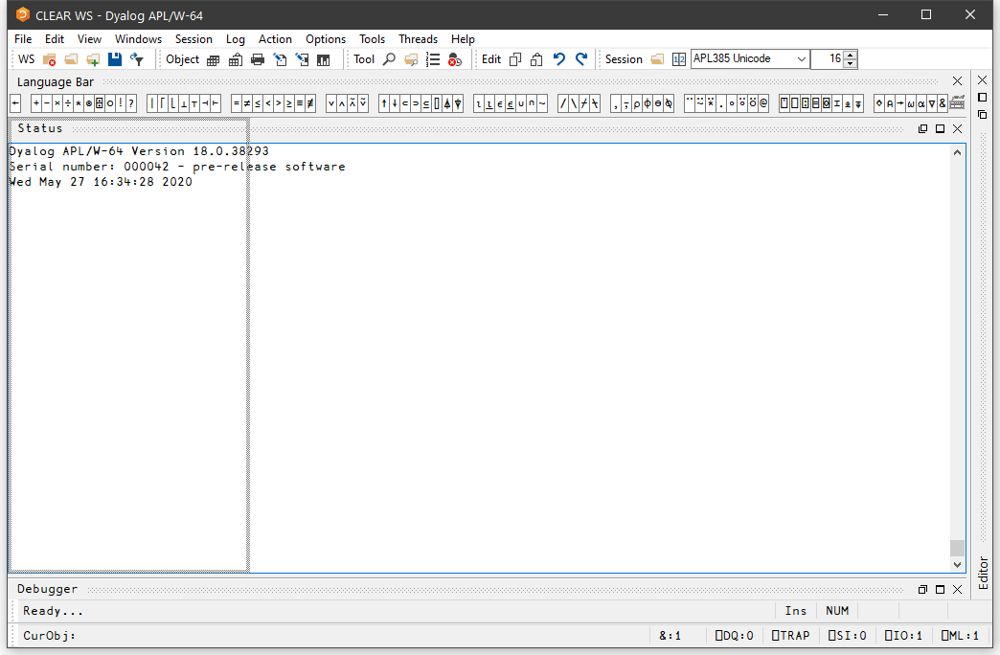

<h1 class="heading">The Session Window</h1>

The primary purpose of the session window is to provide a scrolling area within which you may enter APL expressions and view results. This area is described as the *session log*. Normally, the session window will have a menu bar at the top with a tool bar below it. At the bottom of the session window is a status bar. However, these components of the session may be extensively customised and, although this chapter describes a typical session layout, your own session may look distinctly different. A typical Session is illustrated below.

## Window Management

When you start APL, the session is loaded from the file specified by the **session_file** parameter. The position and size of the session window are defined by the Posn and Size properties of the Session object `⎕SE`, which will be as they were when the session file was last saved.[^1]

The name of the active workspace is shown in the title bar of the window, and changes if you rename the workspace or `)LOAD` another.

You can move, resize, minimise or maximise the Session Window using the standard Windows facilities.

In addition to the Session Window itself, there are various subsidiary windows which are described later in the Chapter. In general, these subsidiary windows may be docked inside the Session window, or may be stand-alone floating windows. You may dock and undock these windows as required. The standard Session layout illustrated above, contains docked Editor, Tracer and SIStack windows.

Note that the session window is only displayed **when** it is required, that is, when APL requests input from or output to the session. This means that end-user applications that do not interact with the user through the session will not have an APL session window.

## Docking

Nearly all of the windows used in the Dyalog IDE may be docked in the Session window or be stand-alone floating windows. When windows are docked in the Session, the Session window is split into resizable panes, separated by splitters. The following example, using the Status window, illustrates the principles involved. (The use of the Status window is described later in this Chapter.)

To start with, the Status window is hidden. You may display it by selecting the *Status* menu item from the *Tools* menu. It initially appears as a floating (undocked) window as shown below.

If you press the left mouse button down over the Status window title bar, and drag it, you will find that when the mouse pointer is close to an edge of the Session window, the drag rectangle indicates a docking zone as shown below. This indicates the space that the window will occupy if you now release the mouse button to dock it.

The next picture shows the result of the docking operation. The Session window is now split into 2 panes, with the Status window in the upper pane and the Session log window in the lower pane. You can resize the panes by dragging with the mouse.

You will notice that a docked window has a title bar (in this case, the caption is *Status*) and 3 buttons which are used to *Minimise*, *Maximise* and *Close* the docked window.

The next picture shows the result of minimising the Status window pane. All that remains of it is its title bar. The Minimise button has changed to a Restore button, which is used to restore the pane to its original size.

You can pick up a docked window and then re-dock it along a different edge of the Session as illustrated below.

Docking the Status window along the left edge of the Session causes the Session window to be split into two vertical panes. Notice how the title bar is now drawn vertically.

If you click the right mouse button over any window, its context menu is displayed. If the window is dockable, the context menu contains the following options:

|------------|------------------------------------------------------------------------------------------------|
|**Undock**      |Undocks the docked window. The window is displayed at whatever position and size it occupied prior to being docked |
|**Hide Caption**|Hides the title bar of the docked window                                                                           |
|**Dockable**    |Specifies whether the window is currently dockable or is locked in its current state. You can use this to prevent the window from being docked or undocked accidentally|

The last picture shows the effect of using Hide Caption to remove the title bar. In this state, you can resize the pane with the mouse, but the Minimise, Maximise and Close buttons are not available. However, you can restore the object's title bar using its context menu.

[^1]: In a Windows shortcut to an application,  the Run: state may be one of "Normal window", "Minimised" and "Maximised". There are other states which can be set when a process is spawned. If the Run: state is Normal or Default, Dyalog will use the settings in the current session file to determine the state and size of the session on startup; for all other states (including Maximised and Minimised) these states will be used, superseding the settings in the current session file.
