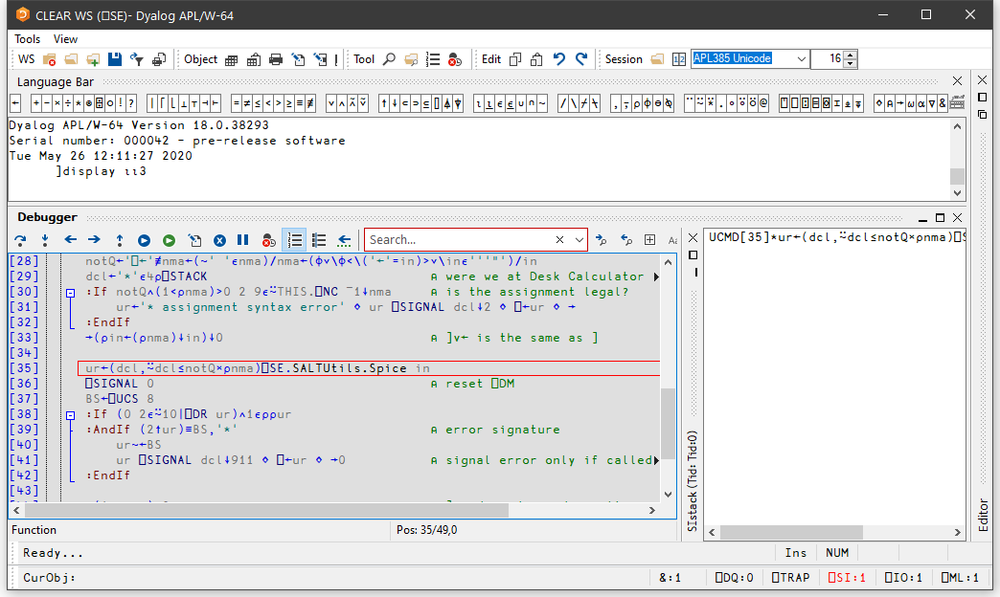
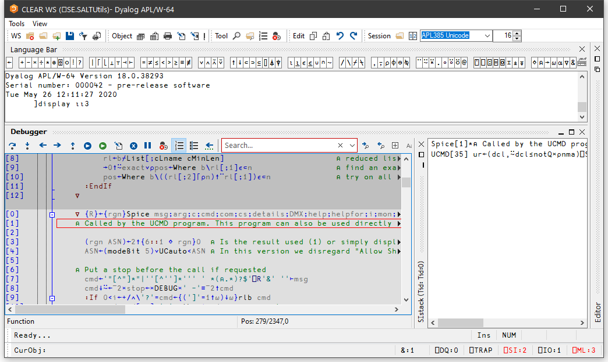

<h1 class="heading"><span class="name">The Tracer</span></h1>

The Tracer is a visual debugging aid that allows you to step through an application line by line. During a Trace you can track the path taken through your code, display variables in edit windows and watch them change, skip forwards and backwards in a function. You can cutback the stack to a calling function and use the Session and Editor to experiment with and correct your code. The Tracer may be invoked in several ways as discussed below.

## Tracing an expression

Firstly, you may explicitly trace an expression that executes one or more defined functions or operators by typing the expression then pressing Ctrl+Enter (TC) or by selecting Trace from the Action menu. This lets you step through the execution of an expression from the beginning.

In the same way as when you execute a statement by pressing Enter, the expression is (if necessary) copied down to the input line and then executed. However, if the expression includes a reference to an unlocked defined function or operator, execution halts at its first line and a Trace window containing the suspended function or operator is displayed on the screen. The cursor is positioned to the left of the first line which is highlighted.

## Naked Trace

The second way to invoke the Tracer is when you have a suspended function in the state indicator and you press Ctrl+Enter (TC) on the empty input line. This is termed *naked trace*. The same thing can be achieved by selecting *Trace* from the *Action* menu on the Session Window.

The effect of naked trace is to open the Tracer and to position the cursor on the currently suspended line. It is exactly as if you had traced to that point from the Input Line expression whose execution caused the suspension.

## Automatic Trace

The third way to invoke the Tracer is to have the system do it automatically for you whenever an error occurs. This is achieved by setting the Show trace stack on error option in the *Trace/Edit* tab of the *Configuration* dialog (**Trace_on_error** parameter). When an error occurs, the system will automatically deploy the Tracer. Note that this means that when an error occurs, the Trace window will then receive the input focus and not the Session window.

## Tracer Options

From Version 10.1 onwards, the Tracer is designed to be docked in the Session window.

In previous versions of Dyalog, the Tracer was implemented as a stack of separate windows (one per function on the calling stack) or as a single, but still separate, window.

You can disable the standard behaviour by selecting *Classic Dyalog mode* from the *Trace/Edit* tab of the *Configuration* dialog box.

If you do so, you may then choose to have the Tracer operate in multiple windows or in a single window.

These alternatives are discussed later in this Chapter.

## The Trace Window

The Tracer is implemented as a single dockable window that displays the function that is currently being executed. There are two subsidiary information windows which are also fully dockable. The first of these (*SIStack*) displays the current function calling stack; the second (*Threads*) displays a list of running threads.

In the default Session files, the Tracer is docked along the bottom edge of the Session window. When you invoke the Tracer, it springs up as illustrated below. In this example, the function being traced is `⎕SE.UCMD`, which is invoked by typing a user-command, in this case `]display`.


In the default layout, the *SIstack* window is displayed alongside the main Tracer window, although this can be hidden or made to appear as a separate floating window, as required.

## Trace Tools

The Tracer may be controlled from the keyboard, or by using the *Trace Tools* which are arranged along the title bar of the Debugger window. Note that the button names are solely for reference purposes in the description that follows.

|Button||Name|Key Code|Keystroke|Description|
|---|---|---|---|---|---|
||Exec|ER|Enter|Execute expression|
||Trace|TC|Ctrl+Enter|Trace expression|
||Back|BK|Ctrl+Shift+Bksp|Go back one line|
||Fwd|FD|Ctrl+Shift+Enter|Skip current line|
||Continue|BH|&nbsp;|Stop on next line of calling function|
||Restart|RM|`→⎕LC`|Continue execution of this thread|
||Restart all|&nbsp;|&nbsp;|Continue execution of all threads|
||Edit|ED|Shift+Enter|Edit name|
||Exit|EP|Esc|Quit this function|
||Intr|&nbsp;|Ctrl+Pause|Interrupt|
||Reset|CB|&nbsp;|Clear trace/stop/monitor for this object|
||&nbsp;|LN|&nbsp;|Toggle line numbers|
||&nbsp;|&nbsp;|&nbsp;|Search for next match|
||&nbsp;|&nbsp;|&nbsp;|Search for previous match|
||&nbsp;|&nbsp;|&nbsp;|Search hidden text|
||&nbsp;|&nbsp;|&nbsp;|Match case|
||&nbsp;|&nbsp;|&nbsp;|Match whole word|
||&nbsp;|&nbsp;|&nbsp;|Use Regular Expressions|

Using the Trace Tools, you can **single-step** through the function or operator by clicking the *Exec* and/or *Trace* buttons. If you click *Exec* the current line of the function or operator is executed and the system halts at the next line. If you click *Trace*, the current line is executed but any defined functions or operators referenced on that line are themselves traced. After execution of the line the system again halts at the next one. Using the keyboard, the same effect can be achieved by pressing Enter or Ctrl+Enter.

The illustration below shows the state of execution having clicked *Exec* 16 times to reach `⎕SE.UCMD[17]`.



Execution Reached `⎕SE.UCMD[35]`

The next illustration shows the result of clicking *Trace* at this point. This caused the system to trace into `⎕SE.SaltUtils.Spice`, the function called from `⎕SE.UCMD[35]`.

Notice how each function call on the stack is represented by an item in the *SIstack* window.



Execution Reached `⎕SE.SALTUtils.Spice[1]`

The illustration below shows the state of execution having traced deeper into the system.


Execution reached four levels deep

At this stage, the state indicator is as follows:
```apl

      )SI
⎕SE.SALT.Load[1]*
⎕SE.SALTUtils.Spice[249]
⎕SE.UCMD[35]

```

## Controlling Execution

The point of execution may be moved by clicking the *Back* and *Fwd* buttons in the *Trace Tools* window or, using the keyboard, by pressing Ctrl+Shift+Bksp and Ctrl+Shift+Enter.  Notice however that these buttons do not themselves change the state indicator or the display in the *SIStack* window. This happens only when you restart execution from the new point.

You can cut back the stack by clicking the <EP> button in the *Trace Tools* window. This causes execution to be suspended at the start of the line which was previously traced. The same effect can be achieved using the keyboard by pressing Esc. It can also be done by selecting *Exit* from the *File* menu on the Trace Window or by selecting *Close* from its system menu.

The <RM> button removes the Trace window and resumes execution. The same is achieved by the expression `→⎕LC`.

The <BH> button continues execution until the current function has run to completion and control has returned to the calling function. It leaves the Trace window displayed and allows you to watch execution progress.

## Using the Session and the Editor

Whilst using the Tracer you can skip to the Session or to any Edit window and back again. While it is docked, you may resize the Tracer pane by dragging its title bar, and you may use the buttons provided to maximise, minimise and restore the Tracer pane within the Session window.

Unless you move it, the cursor is positioned to the left of the suspended line in the top Trace window.

Depending where the cursor is in the tracer window, pressing Shift+Enter (ED) or selecting *Edit* from the *File* menu may cause an edit window to open.  If the cursor is in the first column of the Trace window, or on whitespace, the Editor is opened on function or operator on top of the stack.  If the cursor in on a name, the Editor is opened on the name under the cursor (point-and-edit).  With the cursor in any other location, no action is undertaken.

When you finish editing, the window reverts to a trace window with the new definition of the function or operator displayed.

You may also open a new edit window from within the Tracer using point-and-edit.

You can copy text from a trace window to the session for editing and execution or for experimentation.

It is possible to skip from the Tracer to the Session and then re-invoke the Tracer on a different expression.

## Setting Break-Points

Break-points are defined by `⎕STOP` and may be toggled on and off in an Edit or Trace window by clicking in the appropriate column. The example below illustrates a function with a `⎕STOP` break-point set on line `[5]`.


`⎕STOP` break-points set or cleared in an Edit window are not established until the function is fixed. `⎕STOP` break-points set or cleared in a Trace window are established immediately.

## Clearing All Break-Points


You can clear all break-points by pressing the above button in the Trace Tools window. This in fact resets `⎕STOP` for all functions in the workspace.

## The Classic mode Tracer

If you select *Classic Dyalog mode* from the *Trace/Edit* tab in the *Configuration* dialog box, the Tracer behaves in the same way as in Dyalog version 8.2. However, the Tracer is not dockable in the Session.

If you select the Classic mode Tracer, you may choose between multiple trace windows or a single trace window using the *Single Trace Window* option.

## Multiple Trace Windows

The following behaviour is obtained by **deselecting** the *Single Trace Window* option.

- Each function on the SI stack is represented by a separate trace window. The top window contains the function that is currently executing, other windows display functions further up the stack, in the order in which they were called.
- When you press Ctrl+Enter or click the *Trace* button on a line that calls another function, a new trace window appears on top of the stack and displays the newly called function.
- When a function exits, its trace window disappears and the focus moves to the previous trace window. When the last function in a traced suspension exits, the last trace window disappears.
- If you click the *Quit this function* button in the *Trace Tools* window, or press Escape, or close the trace window by clicking on its [X] button or typing Alt-F4, the top trace window disappears and the focus moves to the previous trace window
- If you close any of the trace windows further down the stack, the stack will be cut back to the corresponding point, that is, to the line of code that called the function whose trace window you closed.
- The <RM> button removes all the trace windows and resumes execution. The same is achieved by the expression `→⎕LC`. The <CS> button also continues execution, but leaves the trace windows displayed and allows you to watch their progress.
- If you minimise any of the trace windows, the entire stack is minimised to a single icon, from which it may be restored.
- If you drag any Trace window with the mouse and at the same time press Ctrl+Shift, the entire set of Trace windows is dragged.

Note that a maximum of 50 Trace windows may be displayed.

## Single Trace Window

The following behaviour is obtained by **selecting** the Single Trace Window option.

- The trace window contains a combo box whose drop-down displays the contents of the SI stack. This box is not provided if there are multiple trace windows.
- The trace window is re-used when tracing into, or returning from, a called function. This means that there is never more than one trace window present.
- When the last function in a traced suspension exits, the trace window disappears.
- If you click the *Quit this function* button in the *Trace Tools* window, or press Escape, the current function is removed from the stack and the trace window reused to display the calling function if there is one.
- Closing the trace window by clicking on its [X] button or typing Alt-F4 removes the window and *clears the current suspension*. It is equivalent to typing naked branch (`→`) in the session window.
- If you move or resize the trace window, APL remembers its position, so that it reappears in the same position when next used.
