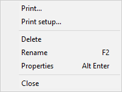

<h1 class="heading">The Workspace Explorer Tool</h1>

The Explorer tool is a modeless dialog box that may be toggled on and off by the system action `[Explorer]`. In a default Session, this is attached to a MenuItem in the *Tools* menu and a Button on the session toolbar.

The Explorer contains two sub-windows. The one on the left displays the namespace structure of your workspace using a TreeView. The right-hand window is a ListView that displays the contents of the namespace that is selected in the TreeView.

The Explorer is closely modelled on the *Windows Explorer* in Windows and the facilities it provides are very similar. For Windows users, the operation of this tool is probably self-explanatory. However, other users may find the following discussion useful.

## Exploring the Workspace

The TreeView displays the structure of your workspace. Initially it shows the root and Session namespaces `#` and `⎕SE`. The icon for `#` is open indicating that its contents are those that appear in the ListView. You can expand or collapse the TreeView of the workspace structure by clicking on the mini-buttons (labelled + and -) or by double-clicking the icons. A single click on a namespace icon opens it and causes its contents to be displayed in the ListView. Another way to open a namespace is to double-click its icon in the ListView. Only one namespace can be open at a time. The icons used in the display are described below.

|-------------------------------------------------------------------------------|----------------------------------------|
|                      |Class                                   |
||Namespace                               |
|            |GUI Namespace                           |
|                |Function                                |
|                |Variable                                |
|                |Operator                                |
|      |Indicates an object that has been erased|
|                  |Type Library                            |
|                          |.NET object                             |

## Viewing and Arranging Objects

The ListView displays the contents of a namespace in one of four different ways namely *Large Icons* view, *Small Icons* view, *List Icons* view or *Details* view. You can switch between views using the *View* menu or the tool buttons that are provided. In the first three views, the system displays the name of the object together with an icon that identifies its type. In *Details* view, the system displays several columns of additional information. You may resize the column widths by dragging or double-clicking the lines in the header. To hide a column, drag its width to the far left. The additional columns are:

|---|---|
|Location|This is the namespace containing the object. By definition, this is the same for all of the objects shown in the ListView and is normally hidden.|
|Type|Type of object.|
|Description|For a function or operator, this is the function header stripped of localised names and comment. For a variable, the description indicates its rank, shape and data type. For a namespace, the description indicates the nature of the namespace; a plain namespace is described as namespace, a GUI Form object is described as Form, and so forth.|
|Size|The size of the object as reported by `⎕SIZE`.|
|Modified on|For functions and operators, this is the timestamp when the object was last fixed. For other objects this field is empty.|
|Modified by|For functions and operators, this is the name of the user who last fixed the object. For other objects this field is empty.|

In any view, you may arrange the objects in ascending order of name, size, timestamp or class by clicking the appropriate tool button. In *Details* view, you may sort in ascending or descending order by clicking on the appropriate column heading. The first click sorts in ascending order; the second in descending order.

## Moving and Copying Objects

You can move and copy objects from one namespace to another using drag-drop or from the Edit menu.

To *move* one or more objects using drag-and-drop editing:

1. Select the objects you want to move in the ListView.
2. Point to one of the selected objects and then press and hold down the left mouse button. When the drag-and-drop pointer appears, drag the object(s) to another namespace in the TreeView. To indicate which of the namespaces is the current target, its name will be highlighted as you drag the selected object(s) over the TreeView.
3. Release the mouse button to drop the objects into place. The objects will disappear from the ListView because they have been moved to another namespace.

To *copy* one or more objects using drag-and-drop editing, the procedure is the same except that you must press and hold the Ctrl key before you release the mouse button.

You may also move and copy objects using the *Edit* menu. To do so, select the object(s) and then choose *Move* or *Copy* from the *Edit* menu. You will be prompted for the name of the namespace into which the objects are to be moved or copied. Enter the namespace and click OK.

## Editing and Renaming Objects

You can open up an edit window for a function or variable by double-clicking its icon, or by selecting it and choosing *Edit* from the *Edit* menu or from the popup menu. You may rename an object by clicking its name (as opposed to its icon) and then editing this text. You may also select the object and choose *Rename* from the *Edit* menu or from the popup menu. Note that when you rename an object, the original name is discarded. Unlike changing a function name in the editor, this is not a copy operation.

## Using the Explorer as an Editor

If you open the *Fns/Ops* item, the names of the functions and operators in the namespace are displayed below it alphabetically in the left (tree view) pane. When you select one of these names, the function itself is opened in the right (list view) pane.

You may use this feature to quickly cycle through the functions (or variables) in a namespace, pressing cursor up and cursor down in the left (tree view) pane to move from one to another.

You may also edit the function directly in the right (list view) pane before moving on to another.

## The File Menu

The *File* menu, illustrated above, provides the following actions. All but *Print setup*  and *Close* act on the object or objects that are currently selected in the ListView.

|-----------|--------------------------------------------------------------------------------------------------------------------|
|Print      |Prints the object(s). Note that if an object is open in the editor, the version shown in the edit window is printed.|
|Print setup|Displays the Print Configuration dialog box.                                                                        |
|Delete     |Erases the object(s).                                                                                               |
|Rename     |Renames the object. This option only applies when a single object is selected.                                      |
|Properties |Displays a property sheet; one for each object that is selected.                                                    |
|Close      |Closes the Explorer                                                                                                 |

## The Edit Menu

|-------------------------------------------------------|---------------------------------------------------------------------|
||&nbsp;                                                               |
|&nbsp;                                                 ||

The *Edit* menu, illustrated above, provides the following actions. The *Edit*, *Copy* and *Move* operations act on the object or objects that are currently selected in the ListView.

|----------------|----------------------------------------------------------------------------|
|Edit            |Opens an edit window for each of the objects selected.                      |
|Copy            |Prompts for a namespace and copies the object(s) there.                     |
|Move            |Prompts for a namespace and moves the object(s) there.                      |
|Select Functions|Selects all of the functions and operators in the ListView.                 |
|Select Variables|Selects all of the variables in the ListView.                               |
|Select None     |Deselects all of the objects in the ListView.                               |
|Select All      |Selects all of the objects in the ListView.                                 |
|Invert Selection|Deselects the selected objects and selects all those that were not selected.|

## The Options Menu

The Options menu, illustrated above, provides the following actions.

|----------------|------------------------------------------------------------------------------------------------------------------------------------------------------------------|
|Toolbar         |Displays or hides the Explorer toolbar.                                                                                                                           |
|Toolbar Captions|Displays or hides the button captions on the Explorer toolbar.                                                                                                    |
|StatusBar       |Displays or hides the Explorer statusbar.                                                                                                                         |
|Type Libraries  |Enables/disables the exploring of Type Libraries                                                                                                                  |
|Expand All      |Expands all namespaces and sub-namespaces in the TreeView, providing a complete view of the workspace structure, including or excluding the Session object `⎕SE` .|
|Refresh Now     |Redisplays the TreeView and ListView with the current structure and contents of the workspace. Used if *Auto Refresh* is not enabled.                             |
|Auto Refresh    |Specifies whether or not the Explorer immediately reflects changes in the active workspace.                                                                       |

If *Auto Refresh* is checked the Explorer is updated every time APL returns to desk-calculator mode. This means that it is always in step with the active workspace. If you have a large number of objects displayed in the Explorer, the update may take a few seconds and you may wish to prevent this by un-checking this menu item  If you do so, the Explorer must be explicitly updated by selecting the *Refresh Now* action.

## The View Menu

The View menu, illustrated above, provides the following actions.

|-------------|---------------------------------------------------------------------------------------------|
|Columns      |Allows you to select which columns you wish to display.                                      |
|Large Icons  |Selects *Large Icons* view in the ListView.                                                  |
|Small Icons  |Selects *Small Icons* view in the ListView.                                                  |
|List Icons   |Selects *List Icons* view in the ListView.                                                   |
|Details      |Selects *Details* view in the ListView.                                                      |
|Scope        |Allows you to choose whether the Explorer displays objects in local scope or in global scope.|
|Arrange Icons|Sorts the items in the ListView by name, type, size or date.                                 |
|Line up Icons|Rearranges the icons into a regular grid.                                                    |
|Auto Arrange |If checked, the icons are automatically re-arranged when appropriate                         |

.

## The Tools Menu

The *Tools* menu, illustrated above, provides the following actions.

|-------------------|--------------------------------------------------------------------------------------------------------------|
|Find               |Displays the Find Objects Tool                                                                                |
|Go to              |Prompts for a namespace and then opens that namespace in the TreeView, displaying its contents in the ListView|
|Go to Session Space|Opens the namespace in the TreeView control corresponding to the current space in the Session.                |
|Set Session Space  |Sets the current space in the Session to be the namespace that is currently open in the TreeView.             |
